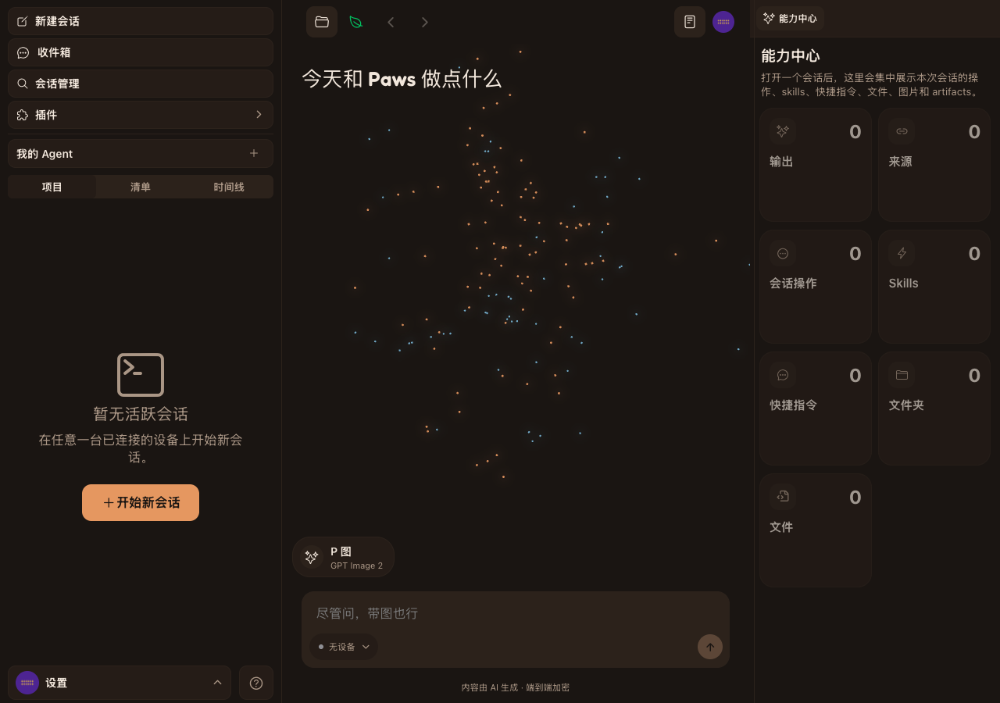
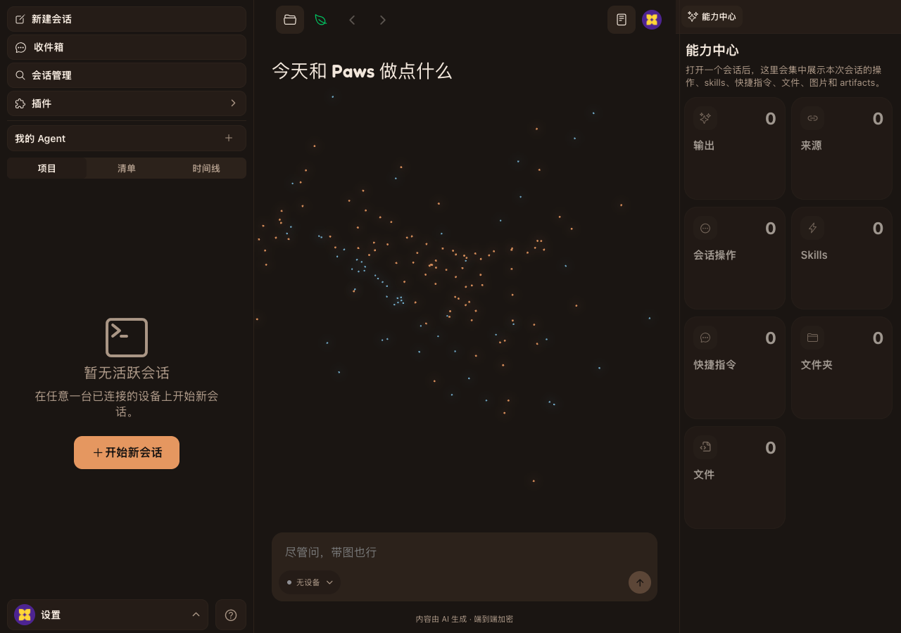
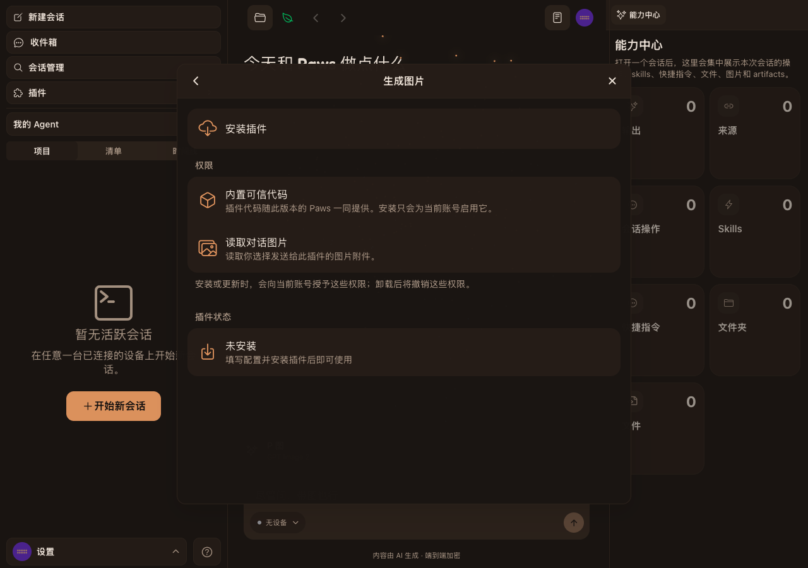
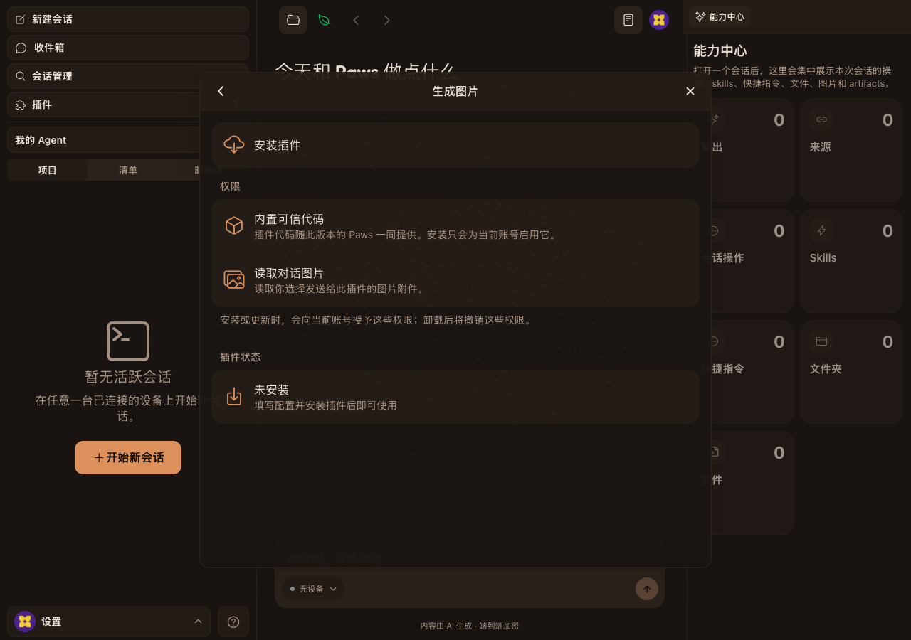

# Image plugin installation gating evidence

- Base: `4473240d` (`origin/main` at capture time)
- Feature revision: `a4016a80`
- Browser: Ego Chromium task space, 1280 × 900 CSS px, DPR 1
- Theme: Gingham dark
- Test data: isolated `authenticated-empty` environments; all environments were stopped and removed after capture

## Case IMG-1 — Hide image creation before installation

Before, the uninstalled account still showed the `P 图 / GPT Image 2` creation rail. After, the same uninstalled state has no image creation rail.

| Before | After |
| --- | --- |
|  |  |

## Case IMG-2 — Keep marketplace state and composer capability consistent

The plugin detail shows `未安装` in both captures. Before, the creation rail remains visible behind the modal; after, it is absent.

| Before | After |
| --- | --- |
|  |  |

## Additional acceptance states

- [Installed gallery](./case-img-3-gallery-after.png): installing the plugin opens the GPT Image 2 gallery.
- [Installed home](./case-img-3-home-after.png): returning home shows `P 图 / GPT Image 2` and the generated-images capability together.
- [Uninstalled deep link](./case-img-4-uninstalled-deeplink-after.png): after uninstall, direct `?mode=image-styles` access does not activate image mode.
