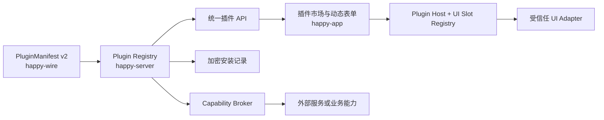

# Paws 动态插件开发规范

本文是 Paws 当前动态插件系统的开发约定，适用于插件清单、安装状态、服务端配置、客户端入口和运行时能力。协议的机器可读定义仍以 [`packages/happy-wire/src/plugins.ts`](../packages/happy-wire/src/plugins.ts) 为准；第一方插件包的源码位于公开的 [`wangjs-jacky/paws-plugins`](https://github.com/wangjs-jacky/paws-plugins) Monorepo。

## 1. 系统定位与安全边界

当前插件系统是一个 **Manifest v2 驱动、构建时集成可信代码、运行时动态挂载贡献点** 的插件系统：

- 服务端动态返回插件清单和当前账号的安装状态；
- App 根据清单动态生成市场列表、配置表单、安装、更新和卸载界面；
- 插件的可复用 Implementation 来自固定 commit 的 `@paws/plugins` Git 依赖；客户端页面以及数据库、Socket 和文件存储 Adapter 必须随受信任的 Paws 代码发布；
- “安装”只启用一个已随 Paws 发布的能力并保存其配置，不下载 npm 包，也不执行清单中的脚本；
- 已安装且版本匹配时，Plugin Host 才把页面、左栏、右栏和弹窗贡献解析到受信任 Adapter；卸载或版本过期会立即撤销全部贡献；
- 服务端 Capability Broker 在每次业务调用时同时检查安装状态、精确版本和 Manifest 权限。

插件清单不得包含 JavaScript、远程模块 URL、任意路由路径或可执行表达式。第三方签名包、沙箱执行和远程代码更新仍不属于 `schemaVersion: 2` 第一阶段的能力范围。身份、密钥保险库、Manifest 校验、Capability Broker、审计、导航骨架和平台适配属于不可插件化的 Paws Kernel。



这里的核心 Module 是 `Plugin Registry`。它以较小的 Interface 封装清单发现、版本校验、配置归一化、脱敏、加密持久化和运行时启用检查，避免各插件重复实现安装 API 和密钥存储。客户端和业务运行时只通过明确的 Seam 接入。

## 2. 模块职责

| Module | 位置 | 职责 | 不应负责 |
|---|---|---|---|
| Wire contract | `packages/happy-wire/src/plugins.ts` | 清单、请求、响应的 Zod schema 和共享类型 | 业务校验、存储、页面跳转 |
| Plugin packages | `paws-plugins/src/plugins/` | 第一方清单、配置白名单、归一化、脱敏和可复用业务逻辑 | Paws 数据库、Socket、Expo 页面 |
| Plugin definitions Adapter | `packages/happy-server/sources/modules/plugins/pluginDefinitions.ts` | 校验外部清单并接入 Paws registry Interface | 重复定义插件清单或配置策略 |
| Plugin registry | `packages/happy-server/sources/modules/plugins/pluginRegistry.ts` | 列表、安装、更新、卸载、版本门禁和运行时配置读取 | 某个插件的业务执行 |
| Installation store | `packages/happy-server/sources/modules/plugins/pluginInstallationStore.ts` | 加密记录的读写、删除和兼容迁移 | 清单展示、业务调用 |
| Generic API | `packages/happy-server/sources/app/api/routes/pluginRoutes.ts` | 认证、协议校验、错误到 HTTP 状态的映射 | 每个插件各自的安装接口 |
| Marketplace UI | `packages/happy-app/sources/components/plugins/` | 动态列表、配置表单和生命周期操作 | 执行服务端下发的代码或路径 |
| Client Plugin Host | `pluginClientAdapters.ts`、`usePluginSurfaceViews.ts` | 校验安装状态、声明贡献点和受信任 Adapter，并投影到页面/左栏/右栏/弹窗 | 接受清单提供的任意 URL、组件名或代码 |
| Runtime Adapter | 各业务 Module，例如 `relationship-advisor/relationshipAdvisorPlugin.ts` | 在执行能力前读取并解析已安装配置 | 绕过 registry 直接读取密文 |

新增插件时优先保持这些 Module 的 Depth：通用行为进入 registry 或市场，插件差异留在 definition 和少量 Adapter 中。不要为了一个插件复制一套安装路由、配置表或设置页面。

## 3. 插件清单契约

`PluginManifest` 的字段含义如下：

| 字段 | 约束 | 约定 |
|---|---|---|
| `schemaVersion` | 当前固定为 `2` | 表示清单协议版本，不是插件版本 |
| `hostApiVersion` | 当前固定为 `1` | Plugin Host API 的主版本；未知版本拒绝解析 |
| `id` | 小写 kebab-case，最长 100 | 发布后不可复用或改名；同时用于存储键和 Adapter 身份校验 |
| `version` | `x.y.z`，可带 prerelease | 安装请求必须与服务端当前清单精确一致 |
| `title` / `description` | `PluginLocalizedText` | `default` 必填；第一方插件至少提供 `zh-Hans`、`zh-Hant` |
| `icon` | 字母、数字或连字符 | 必须是当前 App 已支持的 Ionicons 名称，不得是远程图片 URL |
| `featured` | boolean | 表示市场推荐属性；不要用它表达权限或安装状态 |
| `installedAction` | `configure` 或 `open` | 安装后继续配置，或打开可信的内置能力 |
| `permissions` | 已知权限枚举，最多 20 项 | 只声明真实需要的能力；服务端调用时再次校验 |
| `entrypoint.type` | 固定 `view` | 入口是声明式 View，不是路由或代码 |
| `entrypoint.viewId` | 稳定 contribution ID | 必须引用本清单贡献的 `page` View |
| `contributes.views` | 最多 50 项且 ID 唯一 | ID 必须以 `<pluginId>.` 为命名空间；可声明 `page`、`left-sidebar`、`right-panel`、`modal` |
| `configuration.notice` | 可选本地化文本 | 解释凭据保存位置、计费或隐私影响 |
| `configuration.fields` | 最多 20 项 | 市场据此生成表单；字段顺序即展示顺序 |

配置字段只支持：

- `text`：普通短文本；
- `url`：App 提供 URL 键盘提示，但最终安全校验必须在服务端完成；
- `secret`：App 使用密码输入框，服务端响应只能返回提示，不能回传原值。

字段 key 使用 lowerCamelCase。所有服务端配置 schema 必须 `.strict()`，拒绝清单未声明或业务不认识的字段。

## 4. 插件类型与改动范围

| 类型 | 示例 | 必需改动 |
|---|---|---|
| 内置页面插件 | 生成图片画廊 | definition、客户端页面、可信路由 Adapter |
| 配置 + 服务端能力插件 | 狗头军师 | definition、运行时 Adapter；如可打开独立页面，再增加客户端 Adapter |
| 纯配置开关 | 无外部页面的内置能力 | definition、消费该开关的可信运行时；使用 `installedAction: configure` |
| 新的清单/字段能力 | 新字段类型或入口类型 | wire schema、服务端实现、App 渲染、兼容策略和跨包测试 |

仅增加一个已有类型的插件时，不应修改通用 Interface。先在 `paws-plugins` 发布并通过 CI，再把 Paws 中 `@paws/plugins` 的完整 commit SHA 更新到该 revision。只有平台契约确实无法表达需求时，才扩展 `happy-wire`。

## 5. 新增插件流程

### 5.1 定义清单和配置边界

在 `paws-plugins/src/plugins/<plugin-id>/definition.ts` 中加入一个 `PluginPackageDefinition`，再从外部仓库的 `src/catalog.ts` 导出。清单负责展示，`normalizeConfiguration` 是写入和运行时读取前的权威校验，`redactConfiguration` 负责生成可返回客户端的状态。Paws 的 `pluginDefinitions.ts` 只做协议校验和 Adapter 转换，不得复制插件内容。

```ts
const exampleConfigurationSchema = z.object({
    apiKey: z.string().trim().min(1).max(500),
    baseUrl: providerBaseUrlSchema,
}).strict();

const exampleManifest: PluginManifestV2 = {
    schemaVersion: 2,
    hostApiVersion: 1,
    id: 'example-provider',
    version: '1.0.0',
    title: localized('Example Provider', '示例提供商', '範例提供商'),
    description: localized('Use Example in Paws.', '在 Paws 中使用示例服务。', '在 Paws 中使用範例服務。'),
    icon: 'extension-puzzle-outline',
    featured: false,
    installedAction: 'configure',
    permissions: ['paws.ai.provider.invoke', 'paws.secrets.use'],
    entrypoint: { type: 'view', viewId: 'example-provider.page' },
    contributes: {
        views: [{
            id: 'example-provider.page',
            surface: 'page',
            title: localized('Example Provider', '示例提供商', '範例提供商'),
        }],
    },
    configuration: {
        fields: [
            {
                key: 'apiKey',
                type: 'secret',
                required: true,
                label: localized('API key', 'API 密钥', 'API 金鑰'),
            },
            {
                key: 'baseUrl',
                type: 'url',
                required: true,
                label: localized('Provider URL', '提供商地址', '供應商網址'),
            },
        ],
    },
};
```

实现 definition 时必须满足：

1. `normalizeConfiguration` 返回一个新对象，不保留未知字段；
2. 对 URL、枚举、长度和格式做服务端校验；提供商地址默认只接受无用户名、密码、query 和 fragment 的 HTTPS URL；
3. `redactConfiguration` 的 `configuration` 只能包含非敏感字段；
4. 每个 `secret` 字段只在 `secretHints` 返回不可逆提示，例如末四位；
5. 错误消息不得包含用户提交的配置值。

### 5.2 接入客户端贡献点

清单只声明稳定 View ID；受信任 Paws App 在 `pluginClientAdapters.ts` 注册对应 Adapter：

```ts
'example-provider.page': { surface: 'page', path: '/example-provider' },
```

同时实现对应 Expo Router 页面或 Slot Adapter。受信 Adapter 通过 `Plugin Client Host.register()` 挂载并获得幂等 `dispose()`，其 activation 结束时必须统一撤销。Host 必须同时确认：插件已安装、安装版本等于 Manifest、View 在清单中声明、surface 与本地 Adapter 一致；任一条件不满足都返回 `null`。不要把 `path`、React 组件名加入服务端清单，也不要对清单字符串调用动态 import、`eval` 或 URL 跳转。

`modal` 表示插件贡献一个可由用户动作打开的对话框定义，不表示插件可以任意抢占焦点弹窗。主题、无障碍、排序、密度、同时可见数量及移动端降级均由 Host 决定。

使用 `installedAction: configure` 且没有独立页面时，配置表单由市场弹窗直接渲染，不需要新增一套配置页面。

### 5.3 接入服务端运行时

需要服务端执行能力的插件必须先通过 registry 权限门禁，再读取配置：

```ts
await pluginRegistry.requirePermission(accountId, 'example-provider', 'paws.ai.provider.invoke');
await pluginRegistry.requirePermission(accountId, 'example-provider', 'paws.secrets.use');
const configuration = await pluginRegistry.requireConfiguration(accountId, 'example-provider');
```

再由插件自己的 Runtime Adapter 用更具体的 Zod schema 解析成业务类型。该 Adapter 提供 Locality：插件 ID、业务配置类型和外部服务调用保持在同一业务 Module 附近；加密和生命周期仍封装在 registry 后面。

运行时不得：

- 直接查询 `ServiceAccountToken`；
- 从 App 请求体接收已保存的密钥；
- 在未安装或版本过期时继续执行；
- 把密钥写入日志、错误、遥测、推送或会话消息。

## 6. 安装生命周期

插件状态按以下规则转换：

1. **未安装**：目录中可见，但没有账号安装记录；运行时返回 `plugin_not_installed`。
2. **已安装且为当前版本**：可配置；`open` 插件可以进入可信页面；运行时可以读取配置。
3. **已安装但版本过期**：市场显示更新；运行时返回 `version_mismatch`，直到用户以当前 manifest version 完成 `PUT`。
4. **卸载**：`DELETE` 删除该账号的加密安装记录；重复卸载是幂等操作。

客户端 Slot Registry 只从“已安装且为当前版本”的目录状态派生贡献，不额外持久化 UI 注册表。因此安装或更新后的 refresh 会挂载贡献，卸载或版本过期后的 refresh 会产生等价于 reversible effect 的统一撤销。

通用 API：

| 方法 | 路径 | 行为 |
|---|---|---|
| `GET` | `/v1/plugins` | 返回目录和当前账号的脱敏安装状态 |
| `GET` | `/v1/plugins/:pluginId` | 返回单个目录项 |
| `PUT` | `/v1/plugins/:pluginId` | 安装、更新版本或更新配置 |
| `DELETE` | `/v1/plugins/:pluginId` | 卸载并删除安装记录 |

`PUT` 必须携带清单的精确 `version`。更新配置时，空的 secret 输入表示沿用现有密钥；初次安装时缺少必填 secret 仍会失败。客户端应在成功响应后重新获取目录状态，不能乐观伪造安装结果。

## 7. 版本与兼容性

插件版本遵循 SemVer 意图：

- PATCH：不改变配置或入口契约的修复；
- MINOR：向后兼容的能力或可选配置；
- MAJOR：配置、入口或行为不兼容。

当前 runtime 使用**精确版本门禁**，因此任何 manifest version 变化都会要求用户点击更新。不要为文案修正随意升级插件版本；本地化文案由当前目录直接展示，不依赖安装记录版本。

`schemaVersion` 只在 wire 清单结构变化时升级。升级它需要 App 和 Server 的协调发布、旧客户端行为说明以及协议测试，不能用它代替插件版本。

当前 v2 registry 假设旧安装配置仍能被新版 `redactConfiguration` 安全读取。若要重命名、删除字段或改变字段类型，必须先设计并测试显式迁移；在迁移能力合入前，不得发布会让旧记录无法脱敏的 definition。已有 legacy 加密路径兼容逻辑只用于历史安装记录，不是通用配置迁移机制。

## 8. 加密存储与威胁模型

每个账号、每个插件保存一条安装记录：

- 数据表：`ServiceAccountToken`；
- vendor/storage key：`plugin:<pluginId>`；
- 明文结构：`{ version, configuration }`；
- 加密关联路径：`['user', accountId, 'plugins', pluginId, 'installation']`。

整个安装文档在服务端应用层加密后入库。API 读取状态时只输出非敏感配置和 `secretHints`；卸载会删除对应记录。

这是“服务端可用、数据库静态泄露受保护”的存储模型，不是相对于 Paws 服务端的端到端加密：运行时需要在服务端解密密钥来调用提供商，持有服务端加密密钥并能执行服务端代码的一方仍可访问明文。部署者必须保护服务端密钥、日志、备份和运行环境。通用加密边界见 [`encryption.md`](encryption.md)。

## 9. 错误契约

| 错误码 | HTTP / 使用场景 | 含义 |
|---|---|---|
| `plugin_not_found` | 404 | 服务端不存在该 plugin ID |
| `version_mismatch` | 409；运行时门禁 | 请求或安装记录不是当前版本 |
| `invalid_configuration` | 400 | 配置不满足插件白名单和业务 schema |
| `plugin_not_installed` | 运行时门禁 | 账号尚未安装；若暴露为 HTTP，目前映射为 400 |
| `permission_not_declared` | Capability Broker | 插件调用了 Manifest 未声明的宿主能力 |
| `internal_error` | 500 | 未分类服务端错误 |

对外错误保持稳定、简短且不包含配置值。业务 Runtime 可以把 registry 错误转换为适合用户的提示，但不能把缺少插件静默降级成继续执行。

## 10. 测试与验收门槛

每个新插件至少覆盖：

- wire：合法清单通过、未知字段和可执行入口被拒绝；
- definition：合法配置归一化、未知字段拒绝、URL 约束、secret 不出现在响应；
- registry：安装、重复更新、空 secret 沿用、版本不匹配、幂等卸载、卸载后运行时拒绝；
- storage：密文不含明文 secret、账号/插件隔离、删除、历史记录兼容（如涉及）；
- API：认证、schema、200/400/404/409 响应；
- App：动态表单、必填状态、安装/更新/卸载、各 surface Adapter 白名单、未知/错配贡献拒绝、卸载后贡献撤销；
- runtime：只有已安装、为当前版本且声明相应 permission 时才执行业务能力。

常用检查：

```bash
pnpm --filter @slopus/happy-wire typecheck
pnpm --filter @slopus/happy-wire exec vitest run src/plugins.test.ts

pnpm --filter happy-server-self-host typecheck
pnpm --filter happy-server-self-host exec vitest run \
  sources/modules/plugins \
  sources/app/api/routes/pluginRoutes.spec.ts

pnpm --filter happy-app typecheck
pnpm --filter happy-app exec vitest run \
  sources/components/plugins \
  sources/sync/plugins.test.ts
```

用户可见的市场或表单变化还需要 Web 桌面宽度和移动宽度的可视验收，至少覆盖未安装、已安装、更新和卸载后的状态。

## 11. Definition of Done

合入新插件前确认：

- [ ] ID、版本、入口和安装后动作符合清单契约；
- [ ] 默认文案、简体中文和繁体中文齐全；
- [ ] 服务端使用 strict schema，并有长度、格式和 URL 安全校验；
- [ ] API、日志、错误、测试快照中都没有 secret 明文；
- [ ] `open` 插件只通过可信 Adapter 打开内置页面；
- [ ] 服务端运行时通过 `requirePermission` 和 `requireConfiguration` 检查权限、安装和版本；
- [ ] 更新路径能安全读取旧记录，破坏性配置变更有迁移方案；
- [ ] 卸载删除插件安装记录，并阻止后续运行时调用；
- [ ] 聚焦测试、相关 package typecheck 和可视验收通过；
- [ ] PR 描述标注协议、存储、安全、迁移和客户端版本影响。

## 12. 明确禁止

- 不在清单中增加任意 JavaScript、HTML、远程模块或未经白名单校验的 URL；
- 不从服务端清单直接解析客户端路由、组件或模块；
- 不把 API key 保存到 AsyncStorage、客户端状态持久层或会话消息；
- 不向 App 返回 secret 原值，也不依赖 UI 校验保护服务端；
- 不为单个插件复制安装表、安装 API 或市场 UI；
- 不绕过版本门禁运行过期插件；
- 不把“已安装”等同于下载并信任了第三方代码。

当确实需要开放第三方可执行插件时，应另行设计签名、来源信任、用户授权、沙箱、资源限额、撤销、审计和供应链更新机制，并通过新的运行时/Artifact 契约显式区分，不能把 Manifest v2 的声明式 View 偷换成远程 JavaScript。
