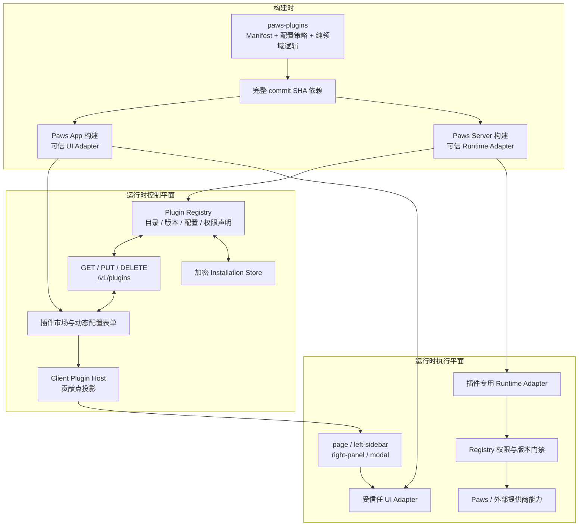

# Paws 插件系统总览与设计审阅

> 当前实现快照：2026-08-30
> 面向对象：产品维护者、Paws 贡献者和第一方插件开发者

本文回答四个容易混淆的问题：Paws 当前所说的“动态插件”到底动态在哪里，点击安装时实际发生什么，`happy` 与独立插件仓库如何分工，以及这套设计距离真正的第三方插件运行时还有多远。

机器可读契约以 [`packages/happy-wire/src/plugins.ts`](../packages/happy-wire/src/plugins.ts) 为准；具体开发约束见 [`plugin-development.md`](plugin-development.md)。本文是系统总览和现状审阅，不替代协议定义。

## 1. 结论先行

Paws 当前实现的是一个：

> **Manifest 驱动、构建时集成第一方可信代码、运行时按账号启用贡献点的插件系统。**

它已经具备插件市场、安装、配置、更新、卸载、服务端加密、精确版本门禁、权限声明，以及页面、左侧栏、右侧栏和弹窗四类 UI contribution。

但这里的“动态”目前只覆盖**目录、安装状态、配置和贡献点启用**，不覆盖可执行代码的下载与加载：

- 点击安装会保存当前账号的安装记录和配置，并启用当前 Paws 构建中已经存在的可信 Adapter；
- 点击卸载会删除安装记录并在目录刷新后撤销入口，但不会从 App 或 Server 物理删除代码；
- 插件 Manifest 不能提供 JavaScript、React 组件、任意路由或远程模块 URL；
- 新增带 UI 或服务端能力的插件，当前仍需要同时修改插件仓库和 Paws 主仓，并重新发布 Paws。

因此，这套设计在**第一方可信插件**范围内是成立且安全方向正确的，但还不能称为 VS Code 式的第三方可执行插件运行时。

## 2. 已有文档

仓库此前已经有三类插件文档：

| 文档 | 作用 | 当前定位 |
|---|---|---|
| [`plugin-development.md`](plugin-development.md) | Manifest、配置、安全、生命周期和测试的开发规范 | 现行规范 |
| [`plans/2026-08-28-plugin-host-v2.md`](plans/2026-08-28-plugin-host-v2.md) | Manifest v2 与 Host 第一阶段的实施计划 | 历史计划 |
| [`research/plugin-host-reference.md`](research/plugin-host-reference.md) | VS Code、DeepSeek Harness 与 Paws 的参考架构调研 | 设计输入 |

缺少的是一篇能从产品和维护视角解释“两个仓库、两条平面、一次安装”的总览。本文补上这一层。

## 3. 仓库边界

### 3.1 独立仓库确实存在

第一方插件源码位于公开仓库 [`wangjs-jacky/paws-plugins`](https://github.com/wangjs-jacky/paws-plugins)：

- 可见性：Public；
- 许可证：MIT；
- 形态：第一方插件 Monorepo；
- 当前插件：`relationship-advisor`（狗头军师）和 `generated-images-gallery`（生成图片画廊）。

这个仓库是独立的 Git 仓库，但它目前不是能被 Paws 在线下载并立即执行的远程插件市场。Paws App 和 Server 都通过**完整 commit SHA** 的 Git 依赖在构建时集成 `@paws/plugins`。

### 3.2 两个仓库分别拥有什么

| 仓库 | 拥有的 Module / Implementation | 不应拥有 |
|---|---|---|
| [`happy`](https://github.com/wangjs-jacky/happy) | Wire contract、Plugin Registry、加密 Installation Store、通用插件 API、市场 UI、Client Host、UI Slot、数据库/Socket/文件存储等高权限 Adapter | 重复维护插件清单和插件配置校验规则 |
| [`paws-plugins`](https://github.com/wangjs-jacky/paws-plugins) | 插件 Manifest、配置归一化、配置脱敏、可复用且不依赖 Paws 基础设施的领域逻辑、发布产物 | Expo 页面、Paws 数据库访问、任意 HTTP/Socket 路由、宿主密钥或远程可执行入口 |

这条 Seam 的意图是：

1. 插件身份、描述、配置规则和纯领域逻辑可以独立审阅、测试和发布；
2. 身份认证、密钥保险库、Capability Broker 和平台 Adapter 留在 Paws Kernel；
3. 任何高权限行为仍必须经过 Paws 主仓的代码评审和发布链路。

这是一个偏安全的第一阶段边界。代价是插件仓库的独立性目前主要体现在**源码所有权和发布节奏**，还没有延伸到**独立运行和独立上线**。

### 3.3 当前构建关系

截至本文快照，App 与 Server 的 `@paws/plugins` 均固定在已发布的 `v0.2.0` 对应 commit `eb24f765b7cb43827701250bb9f1654897fb2c68`：

- [`packages/happy-app/package.json`](../packages/happy-app/package.json)
- [`packages/happy-server/package.json`](../packages/happy-server/package.json)
- [`pnpm-lock.yaml`](../pnpm-lock.yaml)

[`paws-plugins v0.2.0`](https://github.com/wangjs-jacky/paws-plugins/releases/tag/v0.2.0) 已发布 tgz、catalog、release metadata 和 `SHA256SUMS`；Release 的源提交与上述固定 SHA 一致。Paws 仍固定完整 SHA，而不是可移动 tag：插件仓库有新提交或新 Release 时不会自动进入 Paws，必须显式更新依赖并重新构建 App 与 Server。

## 4. 两条平面：控制与执行

理解当前系统最简单的方式，是把它拆成两条平面。

### 4.1 控制平面

控制平面是目前真正动态的部分，负责：

- 发现目录；
- 展示插件市场；
- 按账号安装、更新和卸载；
- 保存和脱敏配置；
- 判断安装版本是否与当前 Manifest 精确匹配；
- 把已安装 contribution 投影到 Host 表面。

### 4.2 执行平面

执行平面负责真正执行业务能力，当前仍是构建时确定的：

- App 页面和 React Native 视图；
- `componentId` 到可信 UI Implementation 的映射；
- Server 的 HTTP、Socket、数据库和文件存储 Adapter；
- AI 提供商调用和插件专用运行时逻辑。



## 5. 点击“安装”时到底发生什么

安装流程不是包管理器行为，而是账号级的能力启用事务：

1. App 从 `GET /v1/plugins` 读取服务端目录和当前账号状态；
2. 市场根据 Manifest 动态生成配置表单；
3. App 在安装页展示内置代码边界和全部权限，再携带当前 Manifest 的精确 `version`、完整 `grantedPermissions` 与配置调用 `PUT /v1/plugins/:pluginId`；
4. Registry 查找可信 definition，校验版本，并要求授权集合与当前 Manifest 声明集合完全一致，再调用插件自己的 `normalizeConfiguration`；
5. 更新配置时，空的 secret 字段会沿用已有密钥；首次安装仍必须提供必填 secret；
6. Server 加密整个 `{ version, grantedPermissions, configuration }` 后写入账号安装记录；
7. App 刷新账号级目录；只有“已安装、版本匹配且授权集合等于当前 Manifest”的 contribution 才会被 Client Host 解析；
8. 业务请求到来时，Server 通过一次 `openRuntime` 读取和解密安装记录；它先要求已保存 grant 快照与当前 Manifest 完全一致，再检查本次调用请求的能力是否已声明，最后返回短生命周期配置上下文。即使部分 grant 已包含本次调用所需权限，整个插件仍处于 `REVIEW_REQUIRED`，任何 Runtime 能力都不能执行。

安装**不会**：

- 下载 GitHub Release、npm 包或 JS bundle；
- 执行插件仓库中的安装脚本；
- 接受 Manifest 提供的路由、组件名或网络代码；
- 修改 Paws 二进制或 Server 文件系统中的代码。

## 6. 生命周期的真实状态

服务端当前持久化的状态很小：

```text
NOT_INSTALLED
      │ PUT current version + exact grants
      ▼
CURRENT ─── version / permission set changed ───► REVIEW_REQUIRED
   │  ▲                                             │
   │  └──── PUT current version + exact grants ─────┘
   │
   └──────── DELETE ──────────────────────────────► NOT_INSTALLED
```

- `CURRENT`：版本匹配且账号授权集合完整，贡献点可见，Runtime 可以通过门禁；
- `REVIEW_REQUIRED`：版本过期、权限声明变化，或历史记录没有授权快照；市场提示更新，贡献点和 Runtime 都 fail closed；
- `DELETE`：删除安装记录，重复卸载幂等。

这里尚不存在通用的 `LOADING / ACTIVE / FAILED / DISPOSING` 执行状态。当前所谓 activation 是从最新目录状态**派生贡献点**，不是启动一个隔离的插件实例。Client Host 虽然提供 Adapter `register()` 和幂等 `dispose()` Interface，但第一方 Adapter 在应用模块加载时注册，安装/卸载并不会加载或卸载这段代码。

## 7. UI contribution 如何落地

Manifest v2 允许声明四类 surface：

| surface | 当前 Host 投影 | 已有示例 |
|---|---|---|
| `page` | 可信 Expo Router 页面 | 狗头军师聊天页、生成图片页 |
| `left-sidebar` | 左侧栏 Slot | 狗头军师历史记录 |
| `right-panel` | 会话右侧能力面板 | 当前会话生成图片 |
| `modal` | 由用户动作打开的配置弹窗 | 狗头军师配置 |

Manifest 只声明稳定的 View ID 和 surface。Paws App 的 [`pluginClientAdapters.ts`](../packages/happy-app/sources/components/plugins/pluginClientAdapters.ts) 再把它们映射到本地可信的 `path` 或 `componentId`。

这个双重校验是重要安全属性：

1. contribution 必须出现在服务端已校验的 Manifest；
2. 本地 Paws 构建必须存在相同插件 ID、View ID 和 surface 的 Adapter；
3. 插件必须已安装、版本匹配，且保存的账号授权集合与 Manifest 完全一致；
4. Adapter 要求的 permission 必须同时出现在 Manifest 声明和账号授权快照中。

任一条件不满足，Host 都返回 `null`。服务端目录因此不能把任意字符串偷换成 App 路由或组件。

不过当前 Slot 的最后一段渲染仍然按 `componentId` 硬编码分支。例如左栏只认识狗头军师历史记录，右栏只认识生成图片。也就是说，Manifest 和 Host 投影已经通用，真正的 renderer registry 还没有通用化。

## 8. 密钥与安装记录保存在哪里

每个账号、每个插件在 Paws Server 保存一条记录：

| 项目 | 当前值 |
|---|---|
| 数据表 | `ServiceAccountToken` |
| vendor/storage key | `plugin:<pluginId>` |
| 加密前文档 | `{ version, grantedPermissions, configuration }` |
| 加密关联路径 | `['user', accountId, 'plugins', pluginId, 'installation']` |

实现位于 [`pluginInstallationStore.ts`](../packages/happy-server/sources/modules/plugins/pluginInstallationStore.ts)。包括 API key 在内的整个安装文档先在服务端应用层加密，再写入数据库；返回 App 的状态只包含普通配置和不可逆 `secretHints`。

卸载会删除该账号的记录。密钥不会保存到 AsyncStorage、App 持久状态或会话消息中。

该模型保护的是数据库静态泄露，不是相对于 Paws Server 的端到端加密：Runtime 必须在服务端解密 API key 才能调用提供商，因此能控制服务端代码和服务端加密主密钥的一方仍然能访问明文。这是服务端代调用方案的预期信任边界。

## 9. 新增一个插件时要改哪个仓库

| 需求 | `paws-plugins` | `happy` | 是否需要重新发布 Paws |
|---|---:|---:|---:|
| 新增 Manifest、配置规则或可复用纯逻辑 | 是 | 更新固定 SHA | 是 |
| 新增已有 surface 的 UI 插件 | 是 | 新增页面/renderer Adapter | 是 |
| 新增需要数据库、Socket、文件或外部调用的插件 | 是 | 新增 Runtime Adapter，并接入 Registry 门禁 | 是 |
| 新增 permission、surface 或字段类型 | 是 | 修改 Wire、Server、App 和兼容测试 | 是 |
| 只为账号安装、更新配置或卸载已有插件 | 否 | 否 | 否 |

因此当前插件仓库不能单独完成一个带新 UI 或新服务端能力插件的上线。它是一个清晰的源码 Module Seam，还不是独立部署单元。

## 10. 设计审阅

### 10.1 目前做对的部分

1. **Registry Module 有足够 Depth。** 目录、安装、更新、卸载、secret 合并、归一化、脱敏和版本门禁集中在一个 Interface 后面，插件不需要各复制一套安装系统。
2. **安全边界清楚。** Manifest 是数据，不是代码；未知字段、未知权限、任意路由和远程脚本默认拒绝。
3. **版本策略 fail closed。** 安装版本不是当前 Manifest 版本时，UI contribution 和 Runtime 都不会继续执行。
4. **密钥处理合理。** secret 只在 Server 使用，整份安装记录加密，App 只能得到提示。
5. **可信 Adapter 形成双重允许列表。** 仅有 Manifest 声明或仅有本地代码都不足以激活一个 View。
6. **仓库职责具备 Locality。** 插件定义和领域逻辑放在插件附近；数据库、Socket 和平台 Implementation 留在 Paws Kernel。
7. **完整 SHA 固定依赖。** 插件源码变化不会在未评审的情况下自动进入 Paws 构建。

### 10.2 本轮完成的 P0 / P1

| 优先级 | 原问题 | 已落地结果 |
|---|---|---|---|
| P0 | `0.2.0` 没有正式 Release，Paws 固定在 PR head | 已发布并回验 `v0.2.0` 全部资产；App / Server 固定到 Release 源提交 `eb24f765…` |
| P1 | “动态插件”容易被理解为动态下载代码 | 市场文案和安装页明确说明“当前 Paws 版本内置的可信代码；安装只按账号启用” |
| P1 | 权限只有 Manifest 声明，没有账号级授权快照 | 安装前展示全部权限；加密持久化 grant；Server Broker 与 Client Host 都要求 grant 快照与 Manifest 完全一致；旧记录或部分授权记录进入明确的“需要重新确认”状态，所有贡献点与 Runtime 能力 fail closed |
| P1 | Runtime 多次读取、解密同一安装记录 | Registry 提供深 Interface `openRuntime(accountId, pluginId, requirements)`；狗头军师一次打开完整 capability context 后才解析图片和调用提供商 |
| P1 | 多个 `usePlugins()` 消费者重复 refresh | 账号级 `PluginCatalogStore` 统一拥有 `idle/loading/ready/error` snapshot；切换账号通过 generation 丢弃旧账号的在途响应，Socket 重连重新拉取目录；消费者只订阅，显式操作才 refresh |

### 10.3 后续问题与建议

| 优先级 | 问题 | 实际影响 | 建议 |
|---|---|---|---|
| P2 | UI Slot 最终依赖固定 `componentId` 条件分支 | 新插件仍要修改每个 Slot，Host Interface 的 Leverage 有限 | 建立按 surface 注册 renderer 的可信 registry；Slot 只遍历已解析 view，不认识具体插件 ID |
| P2 | 没有真正的 activation state 和资源归属 | 目前无法表达插件初始化失败、诊断、原子更新或统一清理 timer/listener | 只有在确实引入独立执行实例时再增加 `LOADING/ACTIVE/FAILED/DISPOSING` 和 disposable scope；当前不要假装已经具备 |
| P2 | 精确版本门禁没有通用配置迁移 Interface | Manifest version 一变化，用户必须更新；破坏性字段变化可能使旧记录无法脱敏 | 为 definition 增加显式、可测试的逐版本 migration；升级先迁移成功再原子写入 |
| P2 | 安装记录复用 `ServiceAccountToken` 且没有审计元数据 | 两个插件时简单有效，规模扩大后难以查询来源、权限、安装时间、失败和撤销历史 | 生态扩大时迁移到第一等 `PluginInstallation`/`PluginGrant` 表，并记录 source、digest、timestamps 和 audit event |
| P2 | 狗头军师仍有专用 HTTP 路由和 Socket event | 新增类似对话插件还会复制协议和 Host glue，业务 Implementation 对 Paws 内部结构耦合较深 | 抽取版本化的流式 AI、image read/write 等 Capability Interface，让插件 Runtime 组合能力而不是增加专用传输协议 |
| P3 | 没有签名 Artifact、撤销列表、隔离运行时和资源限额 | 不能安全接收陌生第三方可执行代码 | 只有产品确认要开放第三方执行插件时，另建 Artifact + signature + sandbox/worker + broker + audit 契约，不在 Manifest v2 上直接加远程 JS |

### 10.4 总体判断

当前设计没有必要推倒重来。最有价值的 Module——Registry、加密 Installation Store、严格 Wire contract 和可信 Adapter Seam——都可以继续保留。

P0 / P1 已把当前可信插件 Host 的安全和数据所有权补齐。下一阶段仍应加深现有 Interface，而不是立刻做一个复杂 Extension Host：

1. 把 UI Slot 的 renderer 注册真正通用化；
2. 增加配置 migration 和安装审计；
3. 评估是否需要可选权限及逐项撤销；当前四项权限均为插件运行所必需，安装/更新授权完整声明集合；
4. 只有出现明确的第三方代码分发需求后，再建设签名 Artifact 与隔离运行时。

这个顺序能保持当前安全性，同时逐步增加插件系统的 Leverage，避免为了两个第一方插件过早承担 VS Code 级运行时的复杂度。

## 11. 当前两个插件的落点

| 插件 | 独立仓库拥有 | Paws 主仓拥有 |
|---|---|---|
| 狗头军师 | Manifest、配置校验/脱敏、聊天与流式 Markdown 等可复用逻辑 | 页面、左栏历史、配置 UI、Socket 流、图片上传/删除、加密配置和外部提供商 Adapter |
| 生成图片画廊 | Manifest、图片数据模型等可复用逻辑 | 页面、右侧面板投影、会话数据读取和平台 UI Adapter |

这正是当前架构的实际边界：两个功能的“插件定义和纯逻辑”在独立仓库，“有宿主权限的实现”仍在 Paws 项目中。

## 12. Source of truth

- Wire contract：[`packages/happy-wire/src/plugins.ts`](../packages/happy-wire/src/plugins.ts)
- Server definitions Adapter：[`pluginDefinitions.ts`](../packages/happy-server/sources/modules/plugins/pluginDefinitions.ts)
- Registry：[`pluginRegistry.ts`](../packages/happy-server/sources/modules/plugins/pluginRegistry.ts)
- Installation Store：[`pluginInstallationStore.ts`](../packages/happy-server/sources/modules/plugins/pluginInstallationStore.ts)
- Generic API：[`pluginRoutes.ts`](../packages/happy-server/sources/app/api/routes/pluginRoutes.ts)
- Client Host：[`pluginClientAdapters.ts`](../packages/happy-app/sources/components/plugins/pluginClientAdapters.ts)
- Marketplace：[`PluginMarketplaceModal.tsx`](../packages/happy-app/sources/components/plugins/PluginMarketplaceModal.tsx)
- Account Catalog Owner：[`pluginCatalogStore.ts`](../packages/happy-app/sources/sync/pluginCatalogStore.ts)
- 独立插件目录：[`paws-plugins/src/catalog.ts`](https://github.com/wangjs-jacky/paws-plugins/blob/main/src/catalog.ts)
- 独立仓库发布规范：[`paws-plugins/RELEASING_CN.md`](https://github.com/wangjs-jacky/paws-plugins/blob/main/RELEASING_CN.md)
