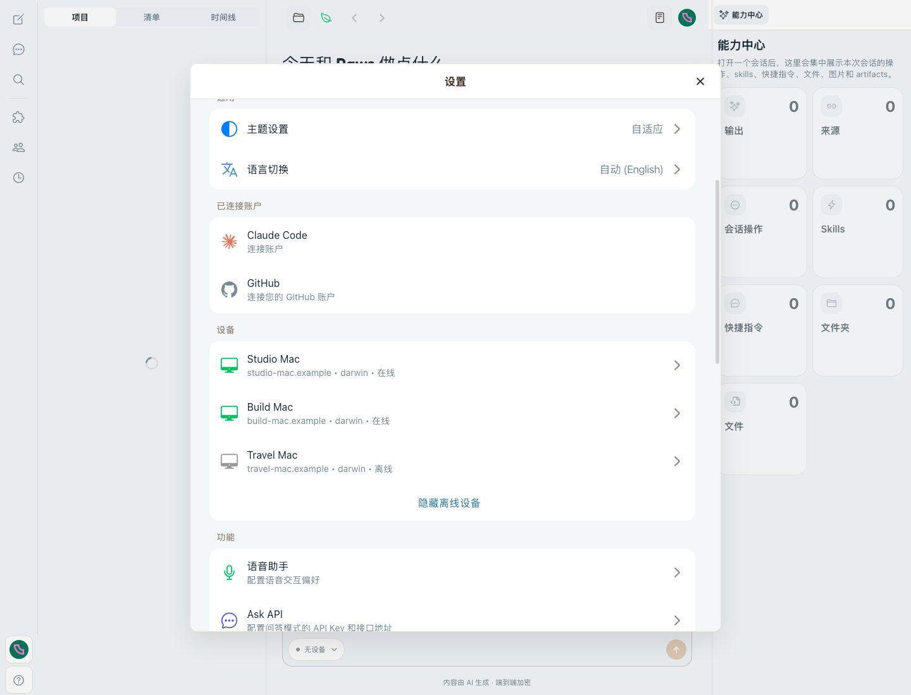
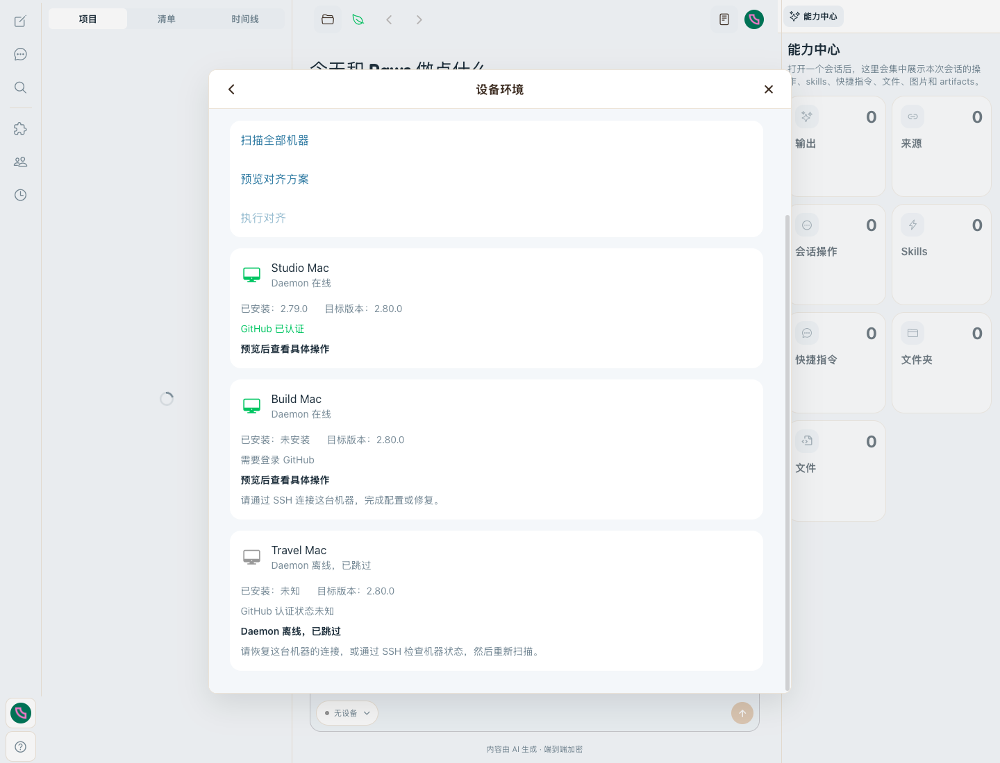
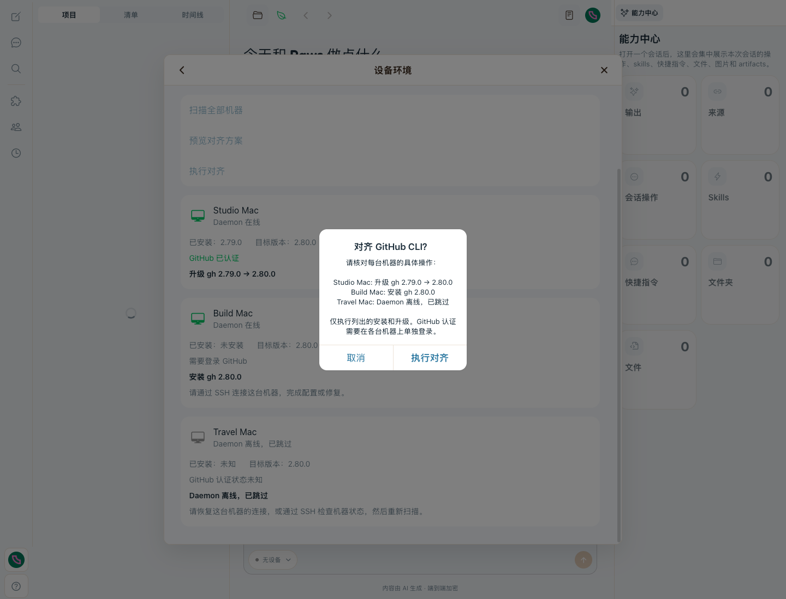
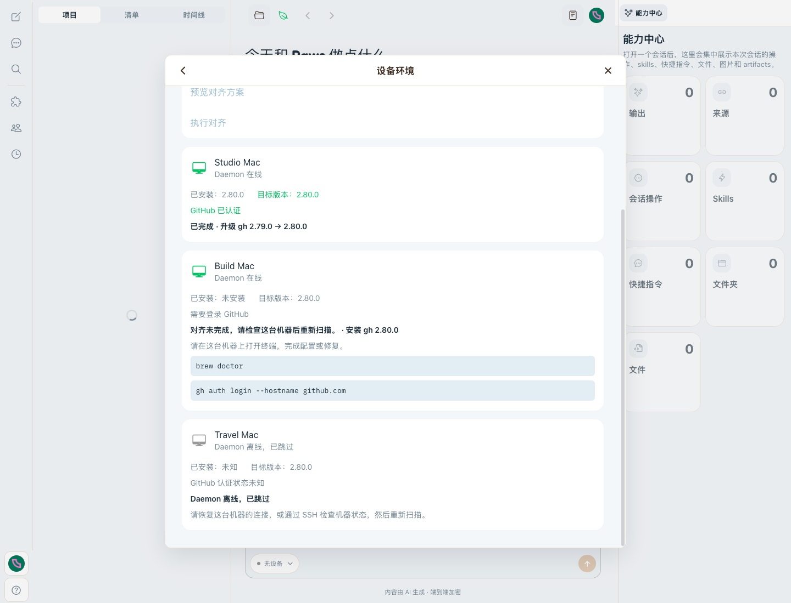
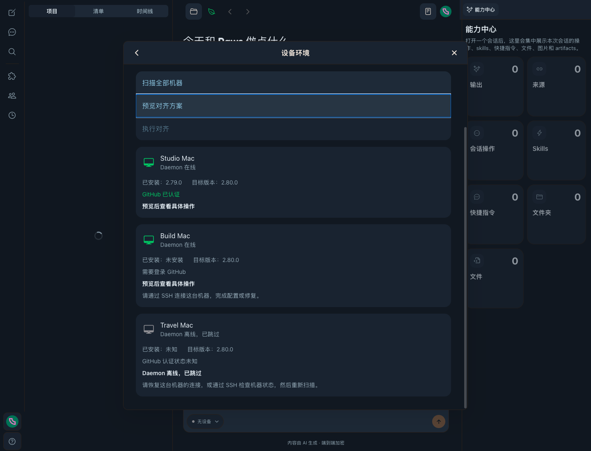

# Device Environment — GitHub CLI POC evidence

Visible UI cases: 4

| Case | Problem | Before | After |
|---|---|---|---|
| ENV-1 Fleet overview | Happy only showed daemon online/offline |  |  |
| ENV-2 Mutation preview | No exact fleet plan existed |  |  |
| ENV-3 Partial result | Multi-device failures could not be compared |  |  |
| ENV-4 Theme states | New surfaces require semantic dark-theme verification |  |  |

The Before image is intentionally shared: the prior product had no Device Environment route. Each After is an independent capture of its named state. Screenshots are unmodified Ego Browser captures at 1440×1100, device scale factor 1. The settings list is scrolled to keep all three machine rows readable; summary counts are verified separately and included in the recorded replay.

## Revisions and fixture boundary

- Before: `36452dccd4f5694e00f0b964d7e54379cc72ceac`, rendered from a separate detached worktree.
- Final verified source: `0f920efadd9dbc840f5e3aa297d389d7ded5d55c`. All four After PNGs were freshly recaptured from this revision, including the offline recovery guidance, incremental results, all-aligned confirmation, timeout recovery, and Apple Silicon support-boundary changes.
- The shared Before is retained after verifying its SHA-256 against the original evidence commit: `8d4f0163f93f855ae5ede5824745b8e3f32c452e3308a180e455095e4fa7308b`.
- Both builds used the repository's Expo Web entry point, with the API endpoint set to unused loopback port `19879`. No API server or daemon was started.
- Browser-only runtime fixtures populated the existing Zustand machine registry and replaced the two exported `environmentOps` functions with deterministic responses. The production Settings route, Device Environment view, fleet hook, and confirmation modal were exercised unchanged. No production fixture code was added.
- Fixture machines: Studio Mac (authenticated, upgrade `2.79.0 → 2.80.0`), Build Mac (not installed, authentication missing, installation requires repair), and Travel Mac (offline). These names and versions are illustrative and distinct from the real local adapter check below.
- Additional variants reuse those three fictional machines: all online/aligned at `2.80.0` with no-op plans; Build Mac apply timing out; and Build Mac reporting unsupported `x64` architecture. These are variants within the four cases, not additional visible cases.
- Environment inspection and application in the browser never reached a real machine. Authentication bootstrap used a synthetic, nonfunctional local credential. Repair commands were displayed only.

## Visible acceptance

| Case | Verified result |
|---|---|
| ENV-1 | All three registered devices remain visible. Online status, installed/target versions, authentication missing, and offline/unknown state are distinct. Only the two online fixture machines are inspected. The offline row advises restoring the connection or checking the machine via SSH, then rescanning. The unsupported variant states that automatic alignment requires an Apple Silicon Mac with Homebrew; it does not claim Intel support. |
| ENV-2 | Preview lists the exact upgrade, installation, and skipped offline machine. Before approval, apply count is zero. Cancel retains the preview and does not apply. The three-device confirmation body fits: 238×144 px, 13 px font, 18 px line height; no clipping or overflow. In the all-aligned variant, confirmation remains enabled and lists all three machines as requiring no version change; Cancel still makes zero calls. |
| ENV-3 | Only the two online machines receive fixture apply calls. Studio Mac retains the successful upgrade; Build Mac retains the attempted installation target and local-terminal repair commands; Travel Mac stays offline. Summary is `1/3` and identifies remaining attention. Approved all-aligned confirmation makes exactly three no-op fixture RPCs, each `changed:false`, and all three rows show completed/no version change. The timeout variant preserves Studio's success, marks Build's state unknown, disables immediate reapply, and explicitly advises waiting for Homebrew/current work to finish, then rescanning, then retrying. |
| ENV-4 | `ginghamDark` resting `#1A2330`, hover/pressed `#1F2A38`, and focus `#283544` match the semantic tokens. Actual pointer press → scan/disable → keyboard Tab now clears the old focus highlight. During disabling and after focus moves to Back, Scan returns to `#1A2330`; only the currently focused action gets `#283544`. |

Scan, preview, and apply publish each machine's result as it settles. With Studio resolving after 150 ms and Build after 1.6 s (inspect) / 1.8 s (apply), Studio visibly updates while Build remains pending and duplicate actions remain disabled. The result is not held until the slowest device finishes.

The settings panel has a working internal scroller (842 px visible area; scanned fleet content 1,025 px, partial-result content 1,144 px). The confirmation dialog itself does not require scrolling for either three-machine fixture. A much larger fleet or unusually long device names is outside this visual sample.

## Fresh cross-package verification

All commands below exited 0:

```sh
pnpm --filter @slopus/happy-wire exec vitest run src/environment.test.ts
pnpm --filter @wangjs-jacky/paws exec vitest run \
  src/environment/processRunner.test.ts \
  src/environment/githubCliAdapter.test.ts \
  src/environment/environmentService.test.ts \
  src/environment/registerEnvironmentHandlers.test.ts \
  src/api/apiMachine.test.ts
pnpm --filter happy-app exec vitest run \
  sources/environment/fleetModel.test.ts \
  sources/hooks/useDeviceEnvironment.test.ts \
  sources/components/environment/DeviceEnvironmentView.test.tsx \
  sources/components/DesktopSettingsModal.test.tsx \
  sources/sync/apiSocket.test.ts
pnpm --filter @slopus/happy-wire run build
pnpm --filter @wangjs-jacky/paws run build
pnpm --filter happy-app run typecheck
git diff --check
```

Results freshly rerun at the final source revision: wire **2/2**, CLI **74/74**, App **69/69**; **145 tests across 11 files, zero failures**. The App suite includes incremental settlements, all-aligned confirmation, offline/timeout/support-boundary copy, and the missing-blur regression. `git diff --check` printed nothing.

Non-failing warnings: React test renderer deprecation in component tests; pkgroll bin paths outside `dist` and empty `index` / `codex/happyMcpStdioBridge` chunks; Metro `NO_COLOR`/`FORCE_COLOR` conflict and `@noble/hashes/crypto.js` fallback resolution. CLI test setup also builds the CLI. No test, typecheck, or build error was suppressed.

## Real local adapter comparison — read only

The adapter's `inspect()` was compared with `gh --version`, `brew info --json=v2 gh`, and `gh auth status --hostname github.com` with `GH_TOKEN`, `GITHUB_TOKEN`, `GH_ENTERPRISE_TOKEN`, and `GITHUB_ENTERPRISE_TOKEN` removed. Both auth output streams were discarded at the process boundary.

| Value | Adapter | Direct commands |
|---|---|---|
| Installed version | `2.98.0` | `2.98.0` |
| Homebrew stable version | `2.100.0` | `2.100.0` |
| Authentication enum | `authenticated` | `authenticated` |

All three direct commands exited 0. No install, upgrade, authentication login, or real environment apply was performed.

## Delivery scope

The same four cases and all new variants passed a fresh Ego-only recorded replay against `0f920efa`. The delivered `device-environment-gh-poc-final-e2e.mp4` is **44.634 seconds**, 1440×1100, H.264, `yuv420p`, 30 fps, silent, **1,715,761 bytes**, with `moov` before `mdat` (`faststart`). It uses **357 fresh Ego frames** captured at nominal 8 fps and resampled to 30 fps for playback. Codec inspection, full decode, whole-timeline contact sheet, full-size confirmation/partial/no-op/timeout/support frames, and redaction checks passed. This final-head video supersedes the earlier 17.5-second replay. All four changed After screenshots and the fresh MP4 were sent to chat; the unchanged Before had already been delivered. The video remains a separate local task artifact and is not part of this evidence commit.

Approximate replay coverage: 0–4 s incremental scan/overview; 4–9 s incremental preview and Cancel; 9–13.5 s incremental apply and partial results; 13.5–25 s all-aligned confirmation, Cancel, approved three-machine no-op and `3/3` summary; 25–33.5 s timeout recovery; 33.5–37.25 s Apple Silicon support boundary; 37.25–44.634 s dark surfaces and actual pointer/disable/Tab focus regression.

MP4 SHA-256: `b25e3ec44bc7027167e09e4be3a70bffe62d6554821c696949630a85d3be7d68`.

These files provide local PR evidence; this task does not push, publish, deploy, or create/update a PR. Before embedding this matrix in a PR, use immutable evidence-commit URLs and verify the actual rendered PR images.
