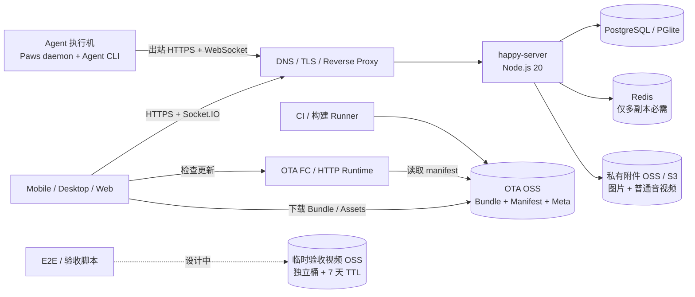

# Paws 自部署运维资源盘点

> 盘点基线：2026-08-30，仓库 `main`（`72c57558e6a1`）。本文盘点的是把 Paws 作为一套可持续运行、发布和恢复的服务所需资源；历史设计文档只作为背景，当前源码、工作流和配置文件优先。

## 1. 结论先行

Paws 不是只有一个后端进程。完整系统至少分成四个平面：

1. **同步与控制平面**：`happy-server`、数据库、附件存储、HTTPS/WebSocket 入口。
2. **Agent 执行平面**：用户电脑、Mac mini 或其他常在线机器上的 Paws CLI/daemon，以及 Claude/Codex/Gemini 等 Agent 运行时。
3. **客户端交付平面**：Web 静态站、Android/iOS/桌面基础安装包。
4. **OTA 发布平面**：构建/发布 Runner、OTA OSS、Expo Updates 协议服务（当前为阿里云 FC）。

因此，你列出的四项方向是对的，但需要做以下校准：

| 你的设想 | 代码核对后的结论 |
| --- | --- |
| 自部署的脚本运行时 | 应拆成三类：核心的 **Agent 执行机**、发布用 **CI/构建 Runner**、可选的 **Public Image Gateway Worker**。三者职责和权限不能混用。 |
| FC 函数用于 OTA | 正确。FC 只负责读取 OSS manifest、实现 Expo Updates 协议；Bundle 和资源文件不经过 FC。 |
| OSS 用于图片存储 | 正确，但当前附件桶不只存图片：App 上传图片、Agent `send_image` 生成图，以及普通音频/视频附件都复用 `happy-server` 的 S3 兼容存储。 |
| OSS 用于视频临时存储（设计中） | 应与普通聊天附件区分。普通音视频附件能力已经进入 `main`；另建 7 天自动清理的“验收视频”桶仍属于设计中资源，不应算进当前最小基线。 |

最小单机自托管只需要：**一台运行 `happy-server` 的主机、一个持久化数据卷、`HANDY_MASTER_SECRET`，以及至少一台 Agent 执行机**。单机模式可使用 PGlite 和本地文件，不需要 Redis、OSS、FC 或 Kubernetes。

面向公网、多人、可恢复的推荐基线则是：**HTTPS 域名/入口 + `happy-server` 计算资源 + 外部 PostgreSQL + 私有附件 OSS + Agent 执行机 + 备份/监控/密钥管理**。多副本时再增加 Redis；需要自建 OTA 时再增加 CI Runner、OTA OSS 和 FC。

## 2. 总体架构与资源边界



关键边界：

- `happy-server` 是加密消息的同步中继和远程控制路由，不负责真正执行 Agent 任务。
- Agent 命令、源码目录、模型凭证和生成文件留在 Agent 执行机上。
- 配置了 OSS/S3 后，附件字节由客户端或 CLI 通过预签名 URL 直传、直下，正常情况下不经过 `happy-server` 转发。
- OTA FC 不保存 OTA 文件，只返回协议响应；文件流量直接由 OSS 承担。
- OTA、用户附件、临时验收视频的公开性、保留周期和风险完全不同，必须使用独立桶或至少独立账号/策略，不能混存。

## 3. 资源总表

状态说明：

- **核心**：不提供就无法完成 Paws 的核心远程会话闭环。
- **生产建议**：单机可以省略，但正式多人或公网运行建议提供。
- **条件必需**：启用对应能力时才需要。
- **设计中/可选**：当前不是生产主链路硬依赖。

| 平面 | 运维资源 | 当前实现 | 必要性 |
| --- | --- | --- | --- |
| 同步控制 | `happy-server` 计算实例/容器 | Node.js 20、Fastify、Socket.IO；API 默认 `3005`，指标默认 `9090` | 核心 |
| 同步控制 | PostgreSQL 或 PGlite | Standalone 用 `/data/pglite`；外部模式用 `DATABASE_URL` | 核心，二选一 |
| 同步控制 | Redis | 设置 `REDIS_URL` 后启用 Socket.IO Redis Streams Adapter | 多副本条件必需；单进程不需要 |
| 同步控制 | 附件本地盘或 S3/OSS | 未设 `S3_HOST` 时写 `/data/files`；设置后使用预签名上传/下载 | 核心能力有附件时必需，二选一 |
| 网络入口 | 域名、DNS、TLS、反向代理/LB | Caddy/Nginx 均可；需支持 `/v1/updates` WebSocket | 公网生产必需；纯内网可降级 |
| 执行 | Agent 执行机 | Paws CLI/daemon + Agent CLI + 项目工作区；只需主动连服务端 | 核心 |
| 客户端 | Web 静态托管 | `happy-app` Web export，可由 Caddy/Nginx、Standalone 或对象存储/CDN 托管 | 使用 Web 客户端时条件必需 |
| 客户端 | 原生基础包构建/分发 | Android/iOS/桌面；基础包固化 OTA URL、channel、runtimeVersion 等 | 使用原生 App 且需独立品牌/OTA 时条件必需 |
| 发布 | CI/构建 Runner | 当前 OTA 工作流使用 GitHub-hosted `ubuntu-latest`、Node 20、pnpm、Aliyun CLI | 自动发布条件必需 |
| OTA | OTA OSS | 当前代码使用 `happy-app-ota-jacky`，保存 `updates/`、`manifests/`、`meta/` | 自建 OTA 条件必需 |
| OTA | OTA manifest 服务 | 当前为 FC v3 Custom Runtime，Node.js 20 | 自建 OTA 条件必需 |
| OTA | OTA 版本浏览站 | 当前可用 GitHub Pages；App 内也有版本入口 | 可选运维体验 |
| 媒体 | 临时验收视频 OSS | 规划独立桶、短期签名 URL、Range、7 天 Lifecycle | 设计中 |
| 生图 | Public Image Gateway + Worker | 仓库仍有 MVP 代码；正式设计是 Gateway + PG lease + OSS + Worker Pool | 可选/实验性，不计入基线 |
| 运维 | 日志、Prometheus、Grafana、告警 | `/health` 和 `/metrics` 已存在，仓库有本地 K8s 示例 | 生产建议 |
| 运维 | Secret Manager / RAM/IAM | Master Secret、数据库、OSS、OTA、第三方服务凭证 | 生产必需 |
| 运维 | 备份与恢复存储 | 数据库、Master Secret、对象存储策略、发布配置 | 生产必需 |

## 4. 同步与控制平面

### 4.1 `happy-server` 计算资源

当前两种运行方式：

| 模式 | 适用场景 | 依赖 |
| --- | --- | --- |
| Docker Standalone | 个人、内网小团队、快速验证 | 单容器 + 持久化 `/data`；PGlite + 本地文件；无需 Redis |
| 外部基础设施模式 | 公网多人、水平扩容、独立备份 | `happy-server` + PostgreSQL + 可选 Redis + S3/OSS |

运行时要点：

- Node.js 20；镜像内还包含 FFmpeg，服务端图片处理使用 Sharp。
- API/Socket.IO 默认监听 `3005`，WebSocket path 为 `/v1/updates`。
- Prometheus 指标服务默认监听 `9090`。该端口不应暴露公网，只开放给监控网络。
- `/health` 会实际查询数据库，可同时作为 readiness/liveness 的基础探针。
- 单机 Standalone 的 `/data/pglite` 与 `/data/files` 必须挂载到持久卷，否则重建容器即丢数据。
- `HANDY_MASTER_SECRET` 是必填项；更换后会让现有鉴权 Token 失效，并使服务端保存的第三方 Token 无法解密。

源码锚点：[Standalone 镜像](../Dockerfile)、[外部依赖镜像](../Dockerfile.server)、[`standalone.ts`](../packages/happy-server/sources/standalone.ts)、[`main.ts`](../packages/happy-server/sources/main.ts)。

### 4.2 数据库

数据库保存账号、公钥身份、机器/会话索引、加密消息、Artifact、KV、使用量、Push Token 和第三方服务 Token 元数据。消息正文大多是客户端加密后的 opaque blob，但数据库仍是核心状态源。

选择原则：

- **PGlite**：只用于单进程、单卷、可接受停机恢复的部署。不能把多个 `happy-server` 副本同时指向同一个普通文件卷。
- **外部 PostgreSQL**：多人、公网、需要备份/PITR 或多副本时使用。应将迁移作为发布步骤，并在切流前完成兼容性检查。
- 数据库备份必须和 `HANDY_MASTER_SECRET` 一起保管；只备份数据库不能恢复服务端加密的第三方 Token。
- 服务器只保存端到端加密后的会话数据。客户端 `~/.happy/access.key` 等密钥材料也要有用户侧恢复策略，否则“服务端数据库恢复成功”不等于“用户还能解密历史数据”。

### 4.3 Redis

当前源码中 Redis **不是单进程启动硬依赖**：只有设置 `REDIS_URL` 时才连接并启用 Redis Streams Adapter。

现有 [`deployment.md`](deployment.md) 仍把 Redis 写成启动必需项，这是旧描述；本文以当前 `main` 的条件初始化逻辑为准。

- 单副本：不需要 Redis，Socket.IO room 和事件路由都在进程内。
- 多副本：必须使用 Redis，让不同副本上的 Web/App/daemon Socket 可以互相发现和转发 RPC/更新。
- 当前 Streams 使用 `socket.io` stream，并配置自动裁剪；仍需监控连接数、stream lag、内存和重连风暴。
- Redis 应仅在内网开放，启用持久化、认证/ACL、备份和 `noeviction` 或经压测确认的策略。

### 4.4 HTTPS、DNS 与反向代理

公网部署至少需要：

- 一个稳定域名或可信的公网 IP 证书方案。
- 80/443（或确定由基础包信任的非标 HTTPS 端口）入口。
- Caddy、Nginx 或云负载均衡器，把 API、`/files/*`、`/health` 和 `/v1/updates` 转发到 `happy-server`。
- WebSocket 长连接超时、升级头、连接数和最大请求体配置。
- 只让反向代理访问 `3005`，只让监控系统访问 `9090`，数据库/Redis/对象存储管理面均不暴露公网。

推荐 Web 与 API 同源，减少 CORS、Cookie、附件 URL 和 WebSocket 配置分叉。详见[自托管 Web App](selfhost-web-deploy.zh-CN.md)。

## 5. Agent 执行平面：真正的“脚本运行时”

Paws Server 不执行用户仓库里的脚本。真正执行 Agent、Shell、测试、构建和图片生成的是 Agent 执行机，例如个人电脑、常在线 Mac mini、Linux 工作站或隔离 Worker。

每台执行机至少需要：

- Node.js 20+ 和 Paws CLI/daemon。
- 对应的 Claude/Codex/Gemini/OpenCode/ACP Agent CLI 及其登录凭证。
- 项目源码、编译工具链和足够的工作区磁盘。
- 持久化 `~/.happy`：配置、身份密钥、daemon 状态、日志、收到的附件、生成图片归档。
- 到 Paws Server、模型服务和依赖源的出站网络。正常情况下无需开放任何公网入站端口。
- 稳定的进程托管、开机启动、资源限额、磁盘清理和日志轮转。

不要让公共 CI Runner、Public Image Gateway Worker 和日常 Paws daemon 共用同一组高权限凭证。建议按用途分账号、分用户、分工作目录，至少做到：

- Agent 执行机可访问用户授权的仓库和模型凭证，但不能管理 OTA/OSS 主账号。
- CI Runner 只拿发布所需的最小权限 RAM 凭证，不拿用户代码执行机的模型凭证。
- Public Image Gateway Worker 只能领取白名单图片任务并上传结果，不能调用任意 Shell/MCP/Paws 会话。

## 6. 对象存储：至少按三类职责隔离

### 6.1 当前附件 OSS：图片与普通音视频

生产环境建议用独立私有桶，例如当前配置中的 `happy-attachments-jacky`。设置 `S3_HOST` 后，`happy-server` 会把附件存储整体切换到 S3 兼容后端。

当前包含：

- 头像和服务端处理后的图片资源。
- App 上传的会话图片附件：端到端加密，object key 以 `.enc` 结尾。
- Agent 通过 `mcp__happy__send_image` 发送的生成图片：复用相同的会话图片附件链路。
- 用户上传的普通音频/视频附件：当前已进入 `main`，最高 500MB，采用明文流式传输，object key 以 `.media` 结尾。

关键配置：

```text
S3_HOST
S3_PORT
S3_USE_SSL
S3_REGION
S3_PATH_STYLE
S3_ACCESS_KEY
S3_SECRET_KEY
S3_BUCKET
S3_PUBLIC_URL
```

阿里云 OSS 使用 virtual-host-style 时需要 `S3_PATH_STYLE=false`。桶应保持 private，由 Server 签发短期上传/下载 URL；Web 端直传还需要按实际来源精确放行 `GET`、`POST`、`PUT`、`HEAD` 等 CORS 方法。

运维注意：

- 图片是端到端加密；普通音频/视频当前是**明文对象**，安全边界是私有桶和短期预签名 URL。
- Server 删除 Session 后会尝试删除 `sessions/<sessionId>/attachments/`，但失败是 non-fatal，必须有孤儿对象巡检或 Lifecycle 兜底。
- 当前线上附件策略为“不自动过期”，保证旧会话图片仍可看。若未来要按成本设置 TTL，应先定义产品保留期，且避免把头像/公共资源一起清掉。
- S3 音视频使用 presigned PUT；签名本身不能强制真实 Content-Length，当前上传频控还是“每进程”级。公网多人部署需增加总量配额、账单告警和更强的网关/账号级限流。
- Standalone 本地 PUT 路由当前仍按 50MB 检查请求体；需要可靠支持接近 500MB 的普通音视频时，应使用 S3/OSS 路径，不要依赖本地文件模式。

源码锚点：[`files.ts`](../packages/happy-server/sources/storage/files.ts)、[`attachmentRoutes.ts`](../packages/happy-server/sources/app/api/routes/attachmentRoutes.ts)、[`apiAttachments.ts`](../packages/happy-app/sources/sync/apiAttachments.ts)、[`send_image` handler](../packages/happy-cli/src/claude/utils/startHappyServer.ts)。

### 6.2 OTA OSS：公开分发资源

OTA 桶当前为 `happy-app-ota-jacky`，职责与用户附件完全不同：

```text
updates/<platform>/<runtime>/<stamp>/...             JS Bundle 与 Assets
manifests/<platform>/<runtime>/<channel>/*.json      latest + 历史 Manifest
meta/<platform>/<runtime>/<channel>/*.json           版本展示元信息
```

它需要让 App 和 FC 能匿名读取发布资源；版本浏览站还会读取 `meta/` 和 `manifests/`。写权限只给发布 Runner 的桶级 RAM 身份。

当前发布脚本会永久保留历史 Bundle。直接按年龄删除 `updates/` 可能让仍保留的历史 Manifest 和回滚版本失效，因此需要“先算引用、再 GC”的保留策略，不能给整个桶套一个简单 TTL。

### 6.3 临时验收视频 OSS：设计中

这是一条独立于“用户普通音视频附件”的规划链路，目标是让 E2E/Agent 生成的验收 MP4 在手机会话中临时播放。

建议保持独立桶（规划名 `happy-acceptance-video-jacky`），原因是：

- 私有 ACL，上传/播放都走短期签名 URL。
- 只接收 MP4/H.264 验收产物，支持 HTTP Range。
- object key 按 `sessions/<sessionId>/<videoId>.mp4` 隔离。
- OSS Lifecycle 统一 7 天自动删除；本地稳定副本保留 24 小时。
- 不进入 Git、OTA 桶、普通附件桶或 ECS 本地盘。
- 当前设计为明文 MP4；脱敏、流式端到端加密、KMS 和审计仍需后续设计。

在相关 Server 签名接口、CLI 发布接口、App Video 对象和自动清理全部落地前，这个桶属于**预留资源**，不要把“桶已创建”等同于能力已经上线。

## 7. OTA 发布平面

### 7.1 构建/发布 Runner

当前 GitHub Actions OTA 流水线使用：

- Linux `ubuntu-latest`。
- Node.js 20、pnpm 10.11.0。
- `pnpm install --frozen-lockfile`。
- `expo export --platform android`。
- Aliyun CLI（包含 `ossutil`）。
- 仓库 Secrets 中的桶级 RAM AccessKey。

如果要求“发布链路也完全自部署”，需要准备 GitHub Self-hosted Runner 或等价 CI 主机，并负责补丁、镜像缓存、磁盘清理、Runner 隔离和高可用。Runner 不应该常驻主数据库或主机 Root 凭证。

Web 部署脚本还需要 `ssh`、`scp`、`tar` 和 SHA256 工具；它负责构建、上传、校验和原子切换静态目录。

### 7.2 OTA FC

当前 [`s.yaml`](../packages/happy-app/ota-server/s.yaml) 定义：

| 项 | 当前值 |
| --- | --- |
| 地域 | `cn-hangzhou` |
| Runtime | `custom.debian11` + 官方 Node.js 20 Layer |
| 内存 | 512MB |
| CPU | 0.35 核 |
| 临时磁盘 | 512MB |
| 超时 | 60 秒 |
| HTTP 触发 | 匿名 `GET` / `POST` / `HEAD` |
| 出网 | 开启，用于读取 OSS Manifest |

FC 根据 `expo-runtime-version`、`expo-platform`、`expo-channel-name` 和 preview 定向参数读取 OSS Manifest，再返回 `multipart/mixed` Expo Updates 响应。它不需要 OSS 写权限，也不保存 Bundle。

FC 可以替换为任意能稳定运行同一 Node HTTP 服务的容器/函数平台，但要注意：

- `updates.url` 在原生基础包里构建时固化，换地址必须重新构建并安装基础包。
- preview/development 当前 runtimeVersion 为 `23`，production 为 `24`；发布脚本、回滚脚本和基础包必须一致。机器可读的唯一来源是 `scripts/ota-runtime-config.js` 与 `ota-runtime-versions.json`。
- FC 不可用时，已安装 App 仍可运行内置/已下载 Bundle，但无法检查和切换 OTA。
- 匿名公网入口应增加函数指标、错误告警、调用量/带宽告警，必要时加 WAF 或限流。

### 7.3 仍需参数化的环境项

复制一套新的自部署环境时，以下位置仍包含当前环境的桶名或 URL，必须成组替换：

- [`publish-ota.js`](../packages/happy-app/scripts/publish-ota.js)：桶、地域、公开 OSS Base。
- [`rollback-ota.js`](../packages/happy-app/scripts/rollback-ota.js)：桶、地域。
- [`ota-server/code/index.js`](../packages/happy-app/ota-server/code/index.js)：公开 OSS Base。
- [`ota-server/site/index.html`](../packages/happy-app/ota-server/site/index.html)：版本站 OSS Base。
- [`app.config.js`](../packages/happy-app/app.config.js)：FC `updates.url`。channel 与 runtimeVersion 已统一从 `scripts/ota-runtime-config.js` 和 `ota-runtime-versions.json` 读取，不应在其他位置再维护一份映射。

更稳妥的后续改造是把这些值集中成按环境加载的配置，并在 CI 发布前做一致性校验。

## 8. Web 与原生客户端交付

### Web

Web 是静态产物，可以：

- 由 Standalone `happy-server` 同进程托管。
- 由 Caddy/Nginx 托管并同源反代 API/WebSocket。
- 放入对象存储/CDN，但 `index.html` 必须短缓存，哈希资源可长缓存。

只有 Native App 的部署不需要 Web 静态站；但 CLI 扫码登录和浏览器使用场景通常仍需要一个可访问的 Web 入口。

### 原生基础包

OTA 不能替代第一份 APK/IPA/桌面安装包，也不能发布原生依赖变化。完全独立部署时需要：

- Android：JDK 17、Android SDK、签名密钥、APK/AAB 存储和分发渠道。
- iOS：macOS/Xcode、Apple 开发者账号、证书/Provisioning Profile 和分发渠道。
- 桌面：对应平台构建机、签名/公证（正式分发时）。
- 在基础包中固化正确的 Server 默认地址、OTA URL、channel、runtimeVersion、Deep Link/App Link 和推送配置。

基础包签名密钥、商店证书和 OTA RAM 凭证应分开保管。

## 9. 可选能力及额外资源

### Public Image Gateway

仓库存在 Public Image Gateway MVP：ECS Gateway 接受公开 Prompt，Mac mini Worker 主动拉任务并调用固定的图片生成命令。该 MVP 使用 JSON 文件状态和 ECS 本地结果目录，不适合作为正式公开服务；现有运维记录也已将该 MVP 停服。

如果重新启用正式版，至少新增：

- 独立 Gateway API 计算资源和 HTTPS 路由。
- 独立 PostgreSQL database/schema，用 lease 队列、事件和额度记录替代 JSON 文件。
- 独立 OSS 结果图存储。
- 一个或多个出站 Worker，以及独立的 Worker Token/Provider API Key。
- 任务租约回收、预算、审核、限流、审计、内容安全和结果保留策略。

这套资源不应与 Paws 核心同步服务混成一个“万能脚本运行时”。参考 [Public Image Gateway MVP](public-image-gateway-mvp.md)。

### 外部 SaaS 依赖

以下不是核心自托管基础设施，但启用对应产品能力时仍会产生外部依赖：

| 能力 | 当前外部依赖 | 不配置/不可达的影响 |
| --- | --- | --- |
| 移动 Push | Expo Push API，之后再到 FCM/APNs | 前台 WebSocket/RPC 仍可用；后台通知失效 |
| Voice | ElevenLabs + RevenueCat | 语音能力不可用 |
| GitHub 连接 | GitHub OAuth/App/Webhook | GitHub 集成不可用 |
| 产品分析 | PostHog | Key 为空时可关闭，不影响核心同步 |
| Agent 推理 | Claude/Codex/Gemini/OpenCode 等提供方或本地模型 | 对应 Agent 无法执行 |

要做到完全隔离内网，移动 Push 是当前最明确的缺口；核心实时控制仍可通过内网 WebSocket 工作。

## 10. 网络与端口建议

| 方向 | 端口/协议 | 建议 |
| --- | --- | --- |
| 用户/App/CLI → 入口 | TCP 443 / HTTPS + WebSocket | 公网唯一业务入口 |
| 入口 → `happy-server` | TCP 3005 | 仅内网/Loopback |
| Prometheus → Server | TCP 9090 | 仅监控网，不公开 |
| Server → PostgreSQL | TCP 5432 | 私网、安全组白名单 |
| Server → Redis | TCP 6379 | 私网、认证/ACL |
| Client/CLI/Server → OSS | HTTPS 443 | 预签名上传/下载和管理 API |
| App → OTA FC | HTTPS 443 | 匿名检查更新入口 |
| FC → OTA OSS | HTTPS 443 | 只读 Manifest |
| Agent 执行机 → 模型/代码源 | HTTPS/SSH | 按 Agent 和仓库白名单放行 |

Agent 执行机无需对公网开放 daemon 端口；daemon 主动连接中心服务，本地控制接口仅监听 `127.0.0.1`。

## 11. Secrets 与 IAM

至少需要管理以下密钥：

| 密钥 | 用途 | 最低要求 |
| --- | --- | --- |
| `HANDY_MASTER_SECRET` | 服务端 Token 和第三方服务 Token 加密 | 32 字节以上随机值；Secret Manager；备份；禁止随意轮换 |
| `DATABASE_URL` | 数据库访问 | 独立账号；最小 schema 权限；定期轮换 |
| `S3_ACCESS_KEY` / `S3_SECRET_KEY` | 用户附件桶 | 仅指定私有桶和必要动作；与 OTA 身份分离 |
| OTA CI RAM AK | 发布 OTA | 仅 OTA 桶读写/list；只放 CI Secret |
| FC 部署身份 | 部署/更新函数 | 与 FC 运行身份分离；不下发给 App |
| Agent/模型凭证 | 在执行机上调用模型 | 不进入服务端、CI 日志或镜像 |
| GitHub/RevenueCat/ElevenLabs | 可选集成 | 仅启用功能时配置，独立轮换 |
| App 签名密钥 | APK/IPA/桌面签名 | 离线备份或专用签名服务；与业务运行密钥隔离 |

不要把 AccessKey 写进 `.env` 后提交 Git；不要复用阿里云主账号 AK；不要让 PR 可修改的非信任工作流直接接触生产写凭证。

## 12. 备份、保留与恢复

### 必须备份

- PostgreSQL：每日全量 + 增量/WAL（或托管 PITR），定期做恢复演练。
- PGlite：一致性快照整个 `/data/pglite`，同时保留迁移版本和镜像版本。
- `HANDY_MASTER_SECRET`、部署配置、域名/TLS 账号和对象存储策略。
- 本地附件模式的 `/data/files`；使用 OSS 时则依赖桶持久性、版本控制和删除审计。
- 原生签名材料和基础包产物。
- 用户侧 `~/.happy` 身份/密钥恢复说明；服务器无法替用户重建端到端加密私钥。

### 保留策略必须分开

| 数据 | 建议策略 |
| --- | --- |
| 数据库消息/状态 | 按产品数据保留政策；备份不应无限保留 |
| 普通图片/附件 | 当前随 Session 删除，长期 Session 默认保留；增加孤儿对象巡检 |
| 普通音视频附件 | 当前与附件同生命周期，但明文且体积大，应尽快明确单独配额/保留期 |
| OTA 历史 | 保留可回滚窗口；GC 时同时检查 Manifest 对 Bundle/Asset 的引用 |
| 临时验收视频 | 设计为 7 天 OSS Lifecycle + 24 小时执行机本地保留 |
| 日志与指标 | 日志按敏感级别脱敏，设置 7/30/90 天等分级保留；指标按容量规划 |

恢复演练至少覆盖：数据库恢复、Master Secret 注入、附件读取、WebSocket 登录、Agent daemon 上线、OTA 检查和一次历史版本回滚。

## 13. 可观测性与告警

生产最低告警建议：

- `happy-server` `/health` 非 200、进程重启、5xx 比例、P95/P99 延迟。
- WebSocket 当前连接数、连接/断开频率、RPC 失败/超时。
- PostgreSQL 连接数、慢查询、磁盘、复制/PITR 状态。
- Redis stream lag、内存、连接数和重启（仅多副本）。
- OSS 4xx/5xx、存储量、出网流量、异常 PUT、生命周期删除量和费用预算。
- FC 错误率、P95、冷启动、调用量和公网流量。
- CI 发布失败、Manifest/Bundle 不一致、OTA `latest` 指向异常。
- Agent 执行机离线、daemon 重启循环、磁盘不足、模型鉴权失效。
- 备份任务失败和“最近一次成功恢复演练”超期。

仓库的 Prometheus/Grafana K8s 文件是本地示例，其中 PostgreSQL、MinIO、Prometheus 使用的 `emptyDir` 或默认密码不适合生产，不能直接当生产清单使用。

## 14. 起步容量建议

以下是**资源申请起点，不是压测结论**；实际容量主要受并发 Socket 数、消息写入量、图片处理、媒体对象量和 Agent 构建任务影响。

| 资源 | 个人/小团队起点 | 正式部署起点 |
| --- | --- | --- |
| `happy-server` | 2 vCPU / 4GB RAM / 20GB 系统盘 + 持久数据卷 | 2 个以上 2 vCPU / 4GB 实例，压测后扩容 |
| PostgreSQL | PGlite 单卷 20GB 起 | 托管或独立 PG，2 vCPU / 4GB、50GB SSD 起，开启 PITR |
| Redis | 不需要 | 1GB 内存起；多副本时必配，按 stream/连接监控扩容 |
| 附件 OSS | 可先本地盘 | 私有桶；按图片/媒体月增量、出网和保留期设预算 |
| Web 静态站 | 与 API 同机 | Caddy/Nginx 或 OSS/CDN，保留至少一版回滚目录 |
| OTA FC | 不启用可省略 | 当前配置 512MB / 0.35 CPU / 512MB 临时盘 |
| CI Runner | 开发机或托管 Runner | 4 vCPU / 8GB RAM / 40GB 临时盘起；原生构建单独扩容 |
| Agent 执行机 | 取决于 Agent/项目 | 与中心服务分离；按并发会话、编译、模拟器和图片任务配置 |

最容易失控的成本通常不是 API CPU，而是：附件/视频的存储与公网下行、OTA 历史资源、CI 构建分钟数、Agent 模型费用，以及未清理的执行机工作区。

## 15. 推荐实施顺序

### P0：先跑通且可恢复

1. 明确采用 Standalone 还是外部 PostgreSQL 模式。
2. 准备 `happy-server`、持久卷、Master Secret、HTTPS 入口和一台 Agent 执行机。
3. 完成数据库/Secret 备份和一次恢复演练。
4. Native/Web/CLI 全部指向同一自部署 Server，验证登录、WebSocket、远程 RPC、图片附件。
5. 公网或需要大音视频时配置独立私有附件 OSS，并完成 App 上传、CLI 下载解密/流式落盘的双向验证。

### P1：补齐生产能力

1. 接入 Prometheus/日志/告警和费用预算。
2. 需要水平扩容时引入 Redis，再上线多副本；不要先上 Redis 后仍只跑单副本。
3. 部署 Web 静态站并完成原子发布/回滚。
4. 建立 CI Runner 的最小权限和发布审计。

### P2：独立 OTA

1. 创建独立 OTA 桶、桶级 RAM 身份和 CORS/匿名读取策略。
2. 部署 FC，验证健康检查和 preview/production Manifest 路由。
3. 成组替换所有硬编码桶名/URL，重新构建基础 App。
4. 跑通 preview 发布、真机 Update ID 验证、production 发布和历史回滚。
5. 设计不会破坏回滚引用的 OTA 垃圾回收策略。

### P3：按需扩展

1. 临时验收视频：先完成安全/保留设计，再创建独立桶和签名链路。
2. Public Image Gateway：按正式版边界新建 Gateway、PG schema、结果 OSS 和隔离 Worker，不复活 JSON/local-disk MVP 作为公网生产。
3. 如果要求完全离线，再单独评估自建 Push、私有依赖/镜像仓库和本地模型服务。

## 16. 关键源码与现有手册

- [后端架构](backend-architecture.md)
- [后端部署说明](deployment.md)
- [内网自托管手册](selfhost-intranet-deploy.md)
- [Web 自托管手册](selfhost-web-deploy.zh-CN.md)
- [CLI/daemon 架构](cli-architecture.md)
- [多副本与 Redis Streams](multi-process.md)
- [`happy-server` README](../packages/happy-server/README.md)
- [OTA 发布脚本](../packages/happy-app/scripts/publish-ota.js)
- [OTA FC 服务](../packages/happy-app/ota-server/code/index.js)
- [OTA preview workflow](../.github/workflows/ota-preview.yml)
- [OTA production workflow](../.github/workflows/ota-production.yml)
- [Public Image Gateway MVP](public-image-gateway-mvp.md)
