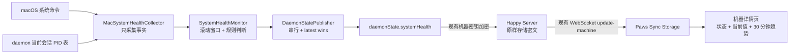

# Paws macOS 远端系统监控 POC 设计

> 在 Paws 现有机器详情页内，以只读方式展示远端 macOS 设备的当前负载、最近 30 分钟趋势和主要资源来源；数据通过现有加密 `daemonState` 实时同步，不引入新的服务端存储。

## 一、背景与决策

Mac mini 最近一次失联并非单一应用导致，而是 Paws 旧 worker 未回收形成的持续进程压力，再叠加 Chrome、Spotlight、Cursor 等高 CPU 占用。现有 Paws 机器详情页只能显示在线状态、daemon 基本信息和 Codex 用量，无法回答以下问题：

1. 设备正在变慢还是已经离线？
2. CPU、内存、Swap 和进程数在过去 30 分钟如何变化？
3. 主要负载来自 Paws worker、Chrome、Spotlight，还是其他应用？
4. Paws worker 是否出现与当前 daemon 会话表不一致的孤儿进程？

本设计采用以下已确认方案：

- 只做监控和预警展示，不清理、不杀进程、不自动修复。
- 只采集 macOS，其他执行机保持现有行为。
- POC 默认关闭，仅当 macOS daemon 设置 `HAPPY_SYSTEM_HEALTH_MONITOR=1` 时启用；首个投放目标是指定 Mac mini，避免所有 macOS 执行机同时产生 15 秒写入。
- 当前数据每 15 秒采集和同步一次。
- 趋势保留最近 30 分钟，每分钟一个点，共 30 个点。
- 复用现有 `daemonState` 的端到端加密与 WebSocket 同步，不修改服务端数据库结构。
- 概念稿只作为信息架构参考；最终界面必须复用 Paws 现有 Header、`ItemList`、`ItemGroup`、主题、字体、间距和响应式宽度。

## 二、目标与非目标

### 2.1 目标

- 用户进入 macOS 机器详情页后，第一屏即可判断设备为正常、需关注、严重或数据已过期。
- 用户能查看 CPU、内存、Swap、总进程、Paws worker 和孤儿 worker 的当前值。
- 用户能查看 CPU、Swap、总进程与孤儿 worker 最近 30 分钟的变化。
- 用户能看到按 CPU 或内存聚合后的主要资源来源，而不是只能猜测是否为 Chrome。
- 采集或同步失败不能影响 daemon 的会话创建、心跳和现有 Codex 用量同步。
- 数据内容保持最小化，不上传完整命令行、环境变量、文件路径或进程参数。

### 2.2 非目标

- 不支持 Linux、Windows 或远端服务器通用监控。
- 不发送系统推送、短信或外部告警。
- 不提供结束进程、释放内存、清理 Swap 或重启 daemon 的新入口。
- 不新增长期指标数据库、跨天报表或多设备聚合面板。
- 不尝试替代专业监控平台；本轮只解决 Paws 单设备、最近 30 分钟的提前发现问题能力。
- 不重做机器详情页的导航和视觉系统。

## 三、总体架构



系统分为四个边界清晰的单元：

| 单元 | 职责 | 输入 | 输出 |
|---|---|---|---|
| `MacProcessSnapshotAnalyzer` | 在本机识别 worker 树与应用族，随后销毁原始 command | 原始进程行、daemon tracked 引用、上一轮成员指纹 | 脱敏 worker/source 事实、下一轮成员指纹 |
| `MacSystemHealthCollector` | 调用 macOS 系统命令、解析资源指标并调用进程分析器，不判断告警 | 操作系统状态、daemon tracked 引用 | 已脱敏 `MacSystemHealthSample` |
| `SystemHealthMonitor` | 定时采集、维护窗口、应用阈值和迟滞规则 | 已脱敏单次采样 | `SystemHealthSnapshot` |
| `DaemonStatePublisher` | 串行化所有 daemonState 写入；监控更新按 latest-wins 合并 | daemon 基础状态、Codex 用量、监控快照、关机状态 | 加密后的 daemonState |
| Paws 展示层 | 校验数据、计算展示模型、渲染 Paws 原生样式 | 解密后的 `systemHealth` | 机器详情监控区 |

服务端继续把 `daemonState` 当作机器级加密 blob 保存和广播，不理解监控字段，也不建立时序数据表。

## 四、macOS 采集与进程归因

### 4.1 采集方式

Collector 只在 `process.platform === 'darwin'` 且 `HAPPY_SYSTEM_HEALTH_MONITOR=1` 时启动。它使用 `execFile` 调用 macOS 绝对路径下的系统命令，不经过 shell，不安装 Homebrew 依赖。所有命令都注入 `LC_ALL=C`，设置 `timeout: 5000`、`killSignal: 'SIGKILL'` 和 `maxBuffer: 4 * 1024 * 1024`：

| 命令 | 数据 | 解析约定 |
|---|---|---|
| `/usr/sbin/sysctl -n hw.ncpu hw.memsize vm.loadavg vm.swapusage` | 核心数、物理内存、负载、Swap used/total | `vm.swapusage` 是当前 Swap 的唯一来源，不从 `top` 猜测 |
| `/usr/bin/top -l 2 -s 0 -n 0` | CPU user/sys/idle | 丢弃第一次采样，解析最后一个 `CPU usage` 行；`used = 100 - idle` |
| `/usr/bin/vm_stat` | 内存页 | 从首行解析 page size；`available estimate = free + inactive + speculative`，压缩内存取 compressor pages；purgeable 不重复相加 |
| `/usr/bin/memory_pressure -Q` | 系统内存压力 | 解析 `System-wide memory free percentage`；内存告警只使用该百分比，不把裸 free pages 当作“可用内存” |
| `/bin/ps -A -ww -o pid= -o ppid= -o pcpu= -o rss= -o etime=` | 进程树与资源 | 每行固定五个无空格字段 |
| `/bin/ps -A -ww -o pid= -o comm=` | 可执行文件 | 只切分开头 PID，整段 remainder 为 comm，不按空格切分 |
| `/bin/ps -A -ww -o pid= -o args=` | 仅本机识别所需参数 | 只切分开头 PID，整段 remainder 为 args，不尝试还原 argv 边界 |
| `/bin/df -kP /` | 系统盘总量与可用空间 | 固定 POSIX 列布局，单位换算为字节 |

三份 `ps` 输出按 PID 连接；某个 PID 只出现在部分表中时保留可用字段，不能错位连接。`etime` 解析必须覆盖 `MM:SS`、`HH:MM:SS`、`DD-HH:MM:SS`；非法值只使该进程缺少 age，不丢弃其他字段。`vm_stat` 必须按输出首行的实际 page size 计算，不能写死 4096 或 16384。进程在三次命令之间退出是正常竞态。

Collector 返回 `MacSystemHealthSample`，包含每个成功字段与 `commandErrors[]`。一条样本只有能够构造 `SystemHealthCurrent` 的全部非可选字段时才是 `complete`；否则为 `partial`。`partial` 样本可更新本机诊断日志和非核心来源信息，但不能替换 `current`、不能进入趋势、不能推动资源告警状态机。磁盘与内存压力百分比缺失不影响 `complete`，对应 UI/规则跳过。多个命令失败时保留多个脱敏错误项，格式为 `{ command: 'vm_stat', code: 'timeout' | 'exit' | 'parse' }`，不上传 stderr。

### 4.2 Paws worker 与孤儿进程

Collector 接收 daemon 当前 `TrackedSession` 的 `{ pid, spawnedAt }` 引用。实现时给新建的普通和 tmux tracked session 都记录 `spawnedAt`；采样进程用 `pid + 由 etime 推导并按 2 秒取整的 startedAt` 作为 birth fingerprint，避免 PID 重用被误认成仍受跟踪。

worker root 按以下可测试规则识别：

1. 不从 `args` 还原通用 argv。入口只接受以下已知模式：comm remainder 的 basename 精确为 `paws`/`happy`；或 comm basename 为 `node` 且 args 以边界正则命中脚本后缀 `/(happy|paws).mjs` 或 Paws CLI `dist/index.mjs`，同时命中已知 agent 子命令。无法明确匹配的命令宁可不计。
2. daemon 标记只通过边界正则 `(?:^|\s)--started-by(?:=daemon|\s+daemon)(?=\s|$)` 判断；不依赖引号或 argv 切分，也不接受普通字符串子串。
3. 多个候选 root 存在祖先关系时只保留最上层候选，避免子树重复计数。
4. 候选 root 与 tracked PID/fingerprint 完全相同，或候选是 tmux tracked pane PID 的后代时，归为正常 worker；tmux 关联只沿当前进程祖先链判断，不按名称猜测。
5. 候选 root 没有关联到当前 tracked 引用时，归为孤儿 worker。daemon 重启后旧 worker 不在新跟踪表中，因此会被识别。
6. 从终端启动且没有 daemon 标记的会话不属于本指标；本轮宁可不计，也不把普通用户进程误报为孤儿。
7. Monitor 记住上一采样中每棵 worker 树的成员 fingerprint。若 root 退出、已知后代被 `launchd` 接管且 fingerprint 未变，剩余后代继续作为该 root 的 orphan remainder 统计；成员全部退出后删除。未知且无 daemon 标记的进程不会因名称相似被追溯为孤儿。

判断逻辑独立为纯函数，输入标准化进程表、tracked 引用和上一采样成员映射，输出互不重叠的 worker 树，便于用 fixture 覆盖普通 spawn、tmux pane、daemon 重启、根进程先退出、嵌套候选和 PID 重用。

进程数据在 Collector 内部的生命周期固定为：

```text
三份 ps 输出
  → RawProcessRow { pid, ppid, cpu, rss, elapsed, comm, args }
  → MacProcessSnapshotAnalyzer.analyze(...)
  → ProcessFacts { workerStats, sanitizedSources, nextWorkerMembership }
  → 立即释放 RawProcessRow / comm / args
  → MacSystemHealthSample（只含数值、脱敏名称、稳定 ID）
```

Collector 实例持有 `previousWorkerMembership`，每次分析后替换为 `nextWorkerMembership`；Monitor 永远拿不到 `comm/args`。`MacSystemHealthSample` 明确包含当前资源数值、worker/orphan 汇总、全部脱敏应用族的本地 CPU 序列以及用于同步的 top 5 列表；Monitor 用“全部脱敏应用族”做持续规则，构造 `SystemHealthSnapshot` 时只保留 top 5。

### 4.3 主要资源来源

UI 不展示完整命令行。`MacProcessSnapshotAnalyzer` 在本机把进程标准化为应用族并聚合 CPU/RSS；Monitor 只维护 Analyzer 输出的脱敏来源序列并执行持续规则：

- `Google Chrome*`、`Google Chrome Helper*` → `Chrome`
- `Cursor*`、`Cursor Helper*` → `Cursor`
- `mds`、`mds_stores` → `Spotlight`
- 已识别的 Paws worker 树 → `Paws Workers`
- 其他进程 → 从 comm remainder 最后一个 `/` 之后取得安全 basename；无法得到稳定名称时统一为 `Other`

每次只同步 CPU 前 5 和内存前 5 的来源。每项包含稳定 ID、展示名、CPU、RSS、进程数和最长运行时长；不包含参数、环境变量、用户路径或窗口标题。已知来源 ID 固定为 `chrome`、`cursor`、`spotlight`、`paws-workers`；未知来源 ID 为 `process:` 加本机对完整 comm 做 SHA-256 后的前 12 个十六进制字符，展示名仅使用安全 basename 并限制 40 字符。该 ID 同时用于列表去重和来源告警 subject。

## 五、数据契约

CLI 的 `DaemonStateSchema` 增加可选 `systemHealth`。`MachineMetadataSchema` 同时增加可选 capability：

```ts
systemHealthMonitor?: {
    schemaVersion: 1;
    supported: true;
    enabled: boolean;
    reportedAt: number;
}
```

新 macOS CLI 在注册和 metadata 刷新时始终发布该 capability；feature flag 只决定 `enabled` 和是否启动采集。旧 CLI 没有 capability，App 因而能区分“需要升级 CLI”和“新 CLI 已支持但尚未启用”。旧 daemon 和旧 App 均可忽略新字段，保持向后兼容。

```ts
type SystemHealthResourceStatus = 'healthy' | 'warning' | 'critical';
type SystemHealthValueUnit = 'percent' | 'ratio' | 'bytes' | 'count';

type SystemHealthIssueCode =
    | 'orphan-workers'
    | 'swap-high'
    | 'swap-growing'
    | 'cpu-sustained'
    | 'load-high'
    | 'memory-pressure-high'
    | 'worker-memory-high'
    | 'process-count-high'
    | 'disk-low'
    | 'single-source-cpu-high';

interface SystemHealthCurrent {
    sampledAt: number;
    cpuUsedPercent: number;
    cpuCores: number;
    load1: number;
    load5: number;
    load15: number;
    memoryTotalBytes: number;
    memoryAvailableBytes: number; // free + inactive + speculative 的估算值
    memoryCompressedBytes: number;
    memoryPressureFreePercent?: number;
    swapUsedBytes: number;
    swapTotalBytes: number;
    diskFreeBytes?: number;
    diskTotalBytes?: number;
    processCount: number;
    pawsWorkerRoots: number;
    pawsWorkerProcesses: number;
    pawsWorkerRssBytes: number;
    orphanWorkerRoots: number;
    orphanWorkerProcesses: number;
    orphanWorkerRssBytes: number;
    topCpuSources: SystemHealthSource[];
    topMemorySources: SystemHealthSource[];
}

interface SystemHealthSource {
    id: string;
    name: string;
    cpuPercent: number;
    rssBytes: number;
    processCount: number;
    oldestProcessAgeSeconds?: number;
}

interface SystemHealthHistoryPoint {
    sampledAt: number;
    cpuUsedPercent: number;
    load1: number;
    memoryAvailableBytes: number;
    swapUsedBytes: number;
    processCount: number;
    orphanWorkerRoots: number;
    pawsWorkerRssBytes: number;
}

interface SystemHealthSnapshot {
    schemaVersion: 1;
    platform: 'darwin';
    updatedAt: number | null;     // 最近一次 complete 采样；尚未成功时为 null
    lastAttemptAt: number | null; // 最近一次采集尝试
    resourceStatus: SystemHealthResourceStatus;
    issues: Array<{
        code: SystemHealthIssueCode;
        severity: 'warning' | 'critical';
        subject?: string;
        observed: number;
        threshold: number;
        unit: SystemHealthValueUnit;
        since: number;
    }>;
    current: SystemHealthCurrent | null;
    history: SystemHealthHistoryPoint[]; // 最多 30 点，时间升序
    collector: {
        intervalSeconds: 15;
        historyStepSeconds: 60;
        durationMs: number;
        lastSampleKind: 'complete' | 'partial' | 'failed' | 'pending';
        errors: Array<{
            command: 'sysctl' | 'top' | 'vm_stat' | 'memory_pressure' | 'ps' | 'df';
            code: 'timeout' | 'exit' | 'parse';
        }>;
    };
}
```

`MacSystemHealthSample` 是 Collector 内部类型：核心字段为可选值，并带 `kind` 与 `commandErrors[]`；它不会直接上传。只有 Monitor 判定为 `complete` 后才构造全部核心字段必填的 `SystemHealthCurrent`。因此当前值和趋势中不会用 0 填补采集失败。磁盘、内存压力与 source age 属于非核心可选字段，缺失时 UI/对应规则直接省略。

App 侧增加对应 Zod schema，未知字段剥离。资源、时间、threshold 和 count 字段要求“有限且非负”；`issues.observed` 只要求有限，允许 `swap-growing` 在恢复过程中携带负增长值。展示文本不由 CLI 生成；CLI 只同步 issue code、数值及单位，App 根据语言包本地化。

## 六、采样、历史与同步

### 6.1 调度

- 满足 macOS + feature flag 的 daemon 在连接成功 5 秒后进行首次采样；未启用的设备不创建定时器，也不写 `systemHealth`。
- 此后每 15 秒采样一次；若上一次尚未结束则跳过，不并发执行系统命令。
- Monitor 在内存中保留最近 11 分钟的 complete 15 秒高分辨率样本，用于持续时长、增长率和迟滞判断。
- 每跨过一个自然分钟桶，把该分钟最后一个成功样本压入历史；历史只保留最新 30 点。
- `daemonState.systemHealth.current` 每个 complete 采样更新；`history` 最多每分钟增长一次。partial/failed 采样只更新 collector 诊断，不进入资源窗口。
- 采集得到的新状态进入 `DaemonStatePublisher`，由它在写入时基于最新服务器 state 合并，保留 `codexUsage`、daemon PID、端口和启动时间字段。

`ApiMachineClient.updateDaemonState` 内部增加统一串行队列，所有现有 daemonState 调用者都经过该队列，而不是只给监控单独加锁：

1. 任意时刻最多一个 `machine-update-state` 请求在途。
2. 监控写入使用 `coalesceKey: 'system-health'`；尚未开始的旧监控写入会被新快照替换，保证 latest wins。
3. Codex 用量和连接状态写入不被监控覆盖，按入队顺序执行。
4. 关机写入为最高优先级：等待当前在途请求结束，丢弃尚未开始的监控写入，写入 `shutting-down` 后禁止新监控发布。
5. CAS version mismatch 时先采用服务器返回的新版本，再重新执行 patch handler；handler 必须是基于最新 state 的无副作用纯合并。
6. 慢网络只会积压一个最新监控快照，不会每 15 秒增加一条重试任务。
7. 单次 ACK 使用 Socket.IO `timeout(5000)`；普通写入最多尝试 2 次，且每次尝试前必须确认当前 connection generation 仍为 connected。断连事件递增 generation、清空普通 pending 队列；旧 generation 的迟到 ACK 不更新本地 state/version。
8. Monitor 调度只负责 enqueue，不 await 网络写入，因此 ACK 超时和重试不会阻塞采集、心跳或会话管理。
9. 进入关机时立即标记 Publisher closing、禁止新任务并丢弃 pending health。最多等待当前请求 1 秒：若它仍在途，则递增 generation 使其迟到结果失效，**跳过**远端 `shutting-down` 写入并直接继续清理，绝不并发发第二个请求；若队列已确认无在途请求且仍 connected，才用 1 秒 ACK 超时 best-effort 写 `shutting-down`。无论结果如何，关机总等待不超过 2 秒，随后继续 socket/control server/lock 清理。

### 6.2 失败与重连

- 采集失败不抛出到 daemon 主循环，不影响心跳和会话管理。
- partial/failed 时保留上次 complete 的 `current/history/updatedAt/resourceStatus/issues`，只更新 `lastAttemptAt` 与 collector 诊断；首次一直失败时 `updatedAt/current` 均为 `null`。
- Monitor 定时器、daemon 进程或网络本身停摆时，CLI 不可能再发出“过期”消息，因此 freshness 始终由 App 根据本地时钟和 `updatedAt` 派生，不能相信快照里的旧状态。
- WebSocket 离线时继续在本机采样和维护内存窗口，但不调用发布 API，只替换一个内存中的 pending latest；恢复连接并完成 `running` 状态写入后，再发送最新当前值与最多 30 点历史，不回放每个 15 秒事件。
- daemon 重启后历史从空开始；POC 不从磁盘恢复 30 分钟窗口。

### 6.3 负载与隐私边界

- 单次采集目标耗时低于 2 秒；超过 5 秒视为超时。
- 序列化后的 `systemHealth` 目标小于 32 KB。
- 最多同步 10 条资源来源记录和 30 个历史点。
- 日志只记录耗时、错误码和记录数量，不打印完整进程命令。

## 七、状态规则

资源规则由 CLI 统一计算，App 不复制资源阈值。CLI 输出 `resourceStatus`；App 只根据机器连接和本地时钟派生 freshness 与最终展示状态。

| 指标 | Warning | Critical |
|---|---:|---:|
| 孤儿 worker root | ≥ 1 | ≥ 5 |
| Swap / 物理内存 | ≥ 25% | ≥ 50% |
| 10 分钟 Swap 增长 | ≥ 1 GB | ≥ 2 GB |
| CPU 持续占用 | ≥ 85% 持续 2 分钟 | ≥ 95% 持续 3 分钟 |
| 1 分钟负载 / CPU 核心 | ≥ 1.5 | ≥ 2.0 |
| `memory_pressure -Q` 可用百分比 | < 10% | < 5% |
| Paws worker RSS / 物理内存 | ≥ 20% | ≥ 35% |
| 总进程数 | ≥ 700 | ≥ 900 |
| 系统盘可用空间 | < 15 GB | < 5 GB |
| 单一来源 CPU | ≥ 100% 持续 5 分钟 | ≥ 200% 持续 5 分钟 |

每个 issue 使用 `(code, subject ?? 'global')` 作为独立状态机键，状态为 `clear | warning | critical`。因此 Chrome 与 Cursor 的 `single-source-cpu-high` 可以同时存在：

1. 瞬时规则连续 2 个 complete 样本达到某级阈值后直接进入该级；可以由 clear 直接进入 critical。
2. warning 达到 critical 条件连续 2 次后升级；critical 连续 3 个 complete 样本低于 critical 但仍达到 warning 时降为 warning；连续 3 个样本低于 warning 时清除。
3. 带持续时长的 CPU 规则只有在窗口端点跨度达到要求、有效样本数不低于预期采样数的 80%，且有效样本中至少 80% 达到对应阈值时才命中。总 CPU 分别使用 2 分钟/85% 与 3 分钟/95% 窗口；单一来源使用 5 分钟窗口和 100%/200% 阈值。恢复统一要求连续 3 个 complete 样本低于 warning 阈值。
4. partial/failed 样本不增加也不清零命中/恢复计数；freshness 超时由 App 单独覆盖展示。恢复收到新的 complete 样本后继续状态机。
5. 多个 issue 可共存；`resourceStatus` 取所有 issue 的最高严重度，无 issue 为 healthy。
6. Swap 增长在窗口不足 9.5 分钟时不评估。窗口满足后，从当前时刻前 9.5～10.5 分钟区间选择时间最早的 complete 样本作为基准；区间无样本则本轮不评估。`observed` 为当前值减基准值，可为负；恢复仍需连续 3 次低于 warning 增长阈值。
7. Monitor 对全部脱敏应用族建立本地序列，而不是只看同步出去的 top 5。已存在来源状态机的 subject 在某个 complete 样本中消失时，该样本按 CPU=0 进入恢复；因此来源退出或掉出 top 5 不会让 issue 永久冻结。
8. 只有磁盘、内存压力等真正依赖可选系统字段的规则在字段缺失时不创建、不升级也不恢复；字段恢复后继续判断。

最终展示状态由 App 每 15 秒重算一次，优先级固定为：

1. `!isMachineOnline(machine)` → `offline`。
2. `current/updatedAt` 为空 → `unavailable`（尚无有效样本）。
3. `Date.now() - updatedAt > 120s` → `unavailable`（数据已过期）。
4. `resourceStatus === critical` → `critical`。
5. 数据年龄超过 45 秒或 `resourceStatus === warning` → `warning`；超过 45 秒时额外显示“数据延迟”。
6. 其他情况 → `healthy`。

这样即使 Monitor 卡死、daemon 退出或网络中断，旧的 healthy 快照也不会长期显示正常。阈值作为命名常量集中在 Monitor 模块，POC 不增加用户配置页面。

## 八、Paws 界面设计

### 8.1 与现有 Paws 对齐

保留当前机器详情页的 `Stack.Screen` Header：机器图标、机器名、在线圆点、重命名入口和返回行为均不变。页面继续使用 `ItemList`，监控内容放进现有最大宽度为 800px 的 `ItemGroup` 体系，不使用概念稿中的独立 Terminal Noir 背景、专用字体、扫描线或霓虹外观。

新增监控区位于页面顶部、启动新会话区域之前，使用户先判断设备健康，再决定是否新建会话：

1. `SystemHealthSummary`：一个 Paws surface 内显示状态、首要问题、最后更新时间，以及 CPU、内存、Swap、进程四项紧凑指标。
2. `SystemHealthTrendPanel`：最近 30 分钟由四条上下排列、共享时间轴的 mini sparkline 组成，依次为 CPU（%）、Swap（GB）、总进程（个）和孤儿 worker（个）。每条使用独立且标明单位的 y 域，并显示 latest/min/max，禁止把百分比、字节和计数画到同一坐标轴。使用 `react-native-svg`，颜色取当前 theme 的语义色，不引入新图表依赖。
3. `SystemHealthSources`：沿用 `Item` 的密集列表，显示 CPU 前三来源；每行展示名称、CPU、RSS 和进程数。若内存前三与 CPU 来源不同，再补充最多两项，最终不超过五行。

监控区不是新路由，不新增底部导航入口。现有“启动会话”“Daemon”“Codex 用量”“CLI 可用性”和删除机器区域保持顺序与行为，仅整体向下移动。

### 8.2 响应式行为

- 手机端：指标以 2×2 排布；四条趋势上下排列并占满 ItemGroup 内容宽度；来源列表单列。
- Web/桌面端：继续遵守 800px 内容宽度，不拉成宽屏仪表盘；指标可 4 列，趋势仍保持四个独立尺度，来源列表单列以匹配现有设置页语义。
- 图表标签和数值允许动态缩短，不能横向滚动；最小目标视口为 1024×720。
- 深色与浅色主题都必须使用现有 theme token，状态颜色之外不写死背景和正文色。
- 每条 SVG 趋势同时提供可访问文本摘要，例如“CPU 最近 30 分钟：最低、最高、当前”；状态除颜色外必须有文字与图标。

### 8.3 状态与空态

| 场景 | 展示 |
|---|---|
| macOS + 数据正常 | 完整监控区，状态为正常/需关注/严重 |
| macOS + capability 缺失 | 空态：“更新远端 Paws CLI 后可使用系统监控” |
| macOS + capability supported 但 disabled | 空态：“系统监控尚未启用”，并展示远端需设置的 feature flag 名；不提供远程修改按钮 |
| macOS + capability enabled 但无 `systemHealth` | 显示“等待 daemon 初始化系统监控”；`reportedAt` 超过 45 秒仍无状态则显示 unavailable |
| macOS + 已启用但首次 complete 尚未产生 | 显示“正在采集系统状态”；若 collector 有错误，显示可本地化的错误类别 |
| macOS + 数据过期 | 顶部显示“监控数据已过期”和最后更新时间，保留最后数据但降低透明度 |
| 机器离线 | Header 和原有离线提示照常；监控区显示最后数据与“设备离线”状态 |
| 非 macOS | 不渲染监控区，页面完全保持现状 |
| history 少于 2 点 | 显示当前指标与“正在收集 30 分钟趋势”，不画误导性折线 |
| 某指标缺失 | 只隐藏对应指标，不显示 `NaN`、`0` 占位或伪造数据 |

所有用户可见字符串使用 `t('machine.systemHealth.*')`，补齐仓库当前全部翻译文件。CPU、GB、RSS、Swap、Paws 等技术缩写按各语言通行形式保留。

## 九、错误处理与兼容性

- `systemHealth` 是可选字段；App 必须正常展示没有该字段的旧机器。
- 非 macOS daemon 以及未开启 feature flag 的 macOS daemon 不创建该字段。
- App schema 解析失败时把监控视为不可用，并记录脱敏错误，不让机器详情页崩溃。
- `current` 与 `history` 的时间戳必须单调；收到时间倒退或未来超过 5 分钟的数据时忽略异常点。
- 进程在 `ps` 与读取详情之间退出属于正常竞态，跳过该记录而非让整次采样失败。
- `DaemonStatePublisher` 发生版本冲突时沿用现有 backoff，并以服务器返回的最新 state 重新执行纯 patch，避免覆盖 `codexUsage`；同一时刻最多一个写入在途。
- 机器在线状态仍以现有 `isMachineOnline(machine)` 为准；监控 `updatedAt` 只说明指标新鲜度，不替代机器连接状态。
- 机器详情页挂载时启动 15 秒本地 tick，使 freshness 在没有新 WebSocket 消息时也会从 live 变为 delayed/stale；卸载时清理 timer。

## 十、测试与验收

### 10.1 CLI 行为测试

- 脱敏 macOS 命令 fixture：至少覆盖目标 Mac mini 当前系统版本、`vm_stat` 不同 page size、Swap 解析、三份 ps 表按 PID 连接、带空格 comm/args、四种 `etime`、字段缺失、超时和非数字值。
- complete/partial/failed 判定：关键命令缺失不替换当前值或趋势；多个命令错误全部保留且无 stderr。
- 进程树：普通 spawn、tmux pane、daemon 重启后的孤儿 worker、终端手动会话、根进程先退出、嵌套候选、PID 重用和多层子进程。
- 应用族聚合：Chrome Helper、Cursor Helper、Spotlight、Paws worker 与未知进程。
- 30 点环形历史：分钟去重、时间升序、超过 30 点淘汰最旧点。
- 规则：每条 warning/critical 边界、clear→critical、warning↔critical、3 次恢复、缺失样本、多个 `(code, subject)` issue、来源退出按 0 恢复、持续窗口“双 80%”条件和 9.5～10.5 分钟 Swap 基准。
- 失败隔离：collector 抛错后 daemon 调度仍继续，最后成功快照被保留。
- Publisher：并发监控/Codex/连接/关机写入保持字段；慢网络下最多一条在途和一条 pending health；ACK 超时释放队列；断连 generation 取消；关机 2 秒内返回；CAS 重试后仍 latest wins。
- 预算：序列化 payload 小于 32 KB，命令 `maxBuffer` 与超时生效，连续慢采样不会重叠执行。

### 10.2 App 行为测试

- 纯视图模型覆盖 healthy、warning、critical、delayed、unavailable、offline、无数据和部分可选字段缺失，并验证最终状态优先级。
- 四条独立尺度图表覆盖 0、单点、常量序列、CPU 峰值、Swap 上升、总进程上升和孤儿数下降到 0；断言单位和可访问摘要正确。
- 非 macOS 不渲染；capability 缺失、supported+disabled、enabled+pending 三种空态可区分；首次采集失败显示 collector 类别。
- 机器详情现有启动会话、刷新、重命名、停止 daemon 和删除机器行为不回归。
- 所有语言键存在，测试验证可执行的翻译解析与渲染结果，不锁定自然语言句子。
- `pnpm --filter happy-cli test`、`pnpm --filter happy-cli build`、`pnpm --filter happy-app test` 和 `pnpm --filter happy-app typecheck` 通过。

### 10.3 PC 交互评审

功能实现并有可运行 Web 构建后，按用户要求调用 `pc-web-interaction-reviewer`。主模式选择“全站交互 E2E 走查”的限界版本，只覆盖机器列表 → Mac 机器详情 → 监控区及必要返回路径；不把静态截图当作交互验收。

执行前置固定如下：

1. Mac mini 安装本分支 CLI、设置 `HAPPY_SYSTEM_HEALTH_MONITOR=1` 并连续运行至少 30 分钟；验收前记录其机器名、daemon 在线和 `systemHealth.history.length === 30`，不记录私有地址或凭据。
2. 在 worktree 的 `packages/happy-app` 运行 `pnpm web`，使用 Expo 实际输出的本地 URL，不预设端口。
3. 在委派 `dev-tools:browser-control` 前询问用户是否复用当前 Chrome 登录态；用户不同意或登录态不明确时使用隔离浏览器并由用户完成登录，不绕过认证。
4. 正式 E2E 只读，不停止 daemon、不制造真实高负载。healthy/warning/critical/offline/unavailable 的规则正确性由自动化视图模型测试覆盖；E2E 对当前真实状态给结论，无法观察的状态明确记为“证据不足”，不伪造通过。
5. 实现阶段先把 `artifacts/interaction-review/` 加入仓库 `.gitignore`，并用 `git check-ignore` 验证；证据保存到 `artifacts/interaction-review/macos-system-monitor/<timestamp>/`，不提交截图、录屏、Cookie、请求头、IP 或账号信息。

桌面验收至少覆盖：

- 1440×900、1280×720、1024×768 三个视口。
- 额外使用 390×844 响应式视口完成手机布局的只读滚动检查，作为移动适配证据，不冒充真机验收。
- 机器详情入口可达，Header、监控区和原有区块顺序正确。
- 四条 30 分钟趋势不裁切、不溢出，单位、latest/min/max 和最小文字可读。
- 页面滚动、刷新、返回和重命名入口无互相遮挡，键盘焦点可见。
- 当前数据刷新时页面不跳动，状态变化有可观察反馈。
- 每个确认问题记录视口、复现动作、实际结果、影响、预期、严重度和截图证据；最终结论只用“通过 / 不通过 / 证据不足”。

该阶段默认只读评审；发现问题后先形成问题清单，修复需进入后续实现任务，修复后再按原路径回归。

## 十一、交付顺序

1. 在 shared CLI types 中增加 `systemHealth` 契约，并给 tracked session 增加 PID birth 所需时间。
2. 实现并测试 macOS Collector、进程归因和 Monitor 状态机。
3. 将 `updateDaemonState` 收口为串行 Publisher，再接入 feature flag、15 秒调度和 latest-wins 合并同步。
4. 在 App 增加 schema、视图模型、Paws 风格组件和翻译。
5. 运行 CLI/App 测试、构建与类型检查。
6. 在 Mac mini 上部署新 CLI，确认真实数据能进入 `daemonState`。
7. 启动 Paws Web 构建，执行限界 PC 交互 E2E 评审并形成证据。
8. POC 验收后再单独讨论推送告警、自动清理或长期存储，不在本轮顺带实现。

## 十二、完成标准

- 已开启 feature flag 的 macOS daemon 连续运行 30 分钟后，Paws 机器详情可看到完整 30 点趋势。
- 当前指标在正常网络下距远端采样时间不超过 30 秒。
- fixture 与目标 Mac mini 实测均能区分正常 Paws worker、tmux worker、daemon 重启残留和根进程退出后的已知孤儿后代。
- 能从主要资源来源中识别 Chrome、Cursor、Spotlight 或 Paws Workers 的聚合占用。
- collector 故障不会中断 daemon、会话创建或 Codex 用量同步。
- 服务端无 schema 和数据库迁移，上传内容不含命令参数、环境变量和用户路径。
- UI 与 Paws 现有机器详情视觉和交互一致，PC 视口与 390×844 响应式视口均无溢出或遮挡。
- PC 交互评审完成并给出基于证据的验收结论。
