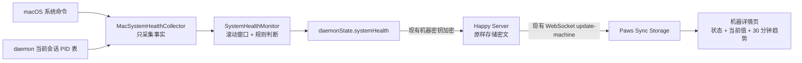

# Paws macOS 远端系统监控 POC 设计

> 在 Paws 现有机器详情页内，以只读方式展示远端 macOS 设备的当前负载、最近 30 分钟趋势和主要资源来源；数据通过现有加密 `daemonState` 实时同步，不引入新的服务端存储。

## 一、背景与决策

Mac mini 最近一次失联并非单一应用导致，而是 Paws 旧 worker 未回收形成的持续进程压力，再叠加 Chrome、Spotlight、Cursor 等高 CPU 占用。现有 Paws 机器详情页只能显示在线状态、daemon 基本信息和 Codex 用量，无法回答以下问题：

1. 设备正在变慢还是已经离线？
2. CPU、内存、Swap 和进程数在过去 30 分钟如何变化？
3. 主要负载来自 Paws worker、Chrome、Spotlight，还是其他应用？
4. Paws worker 是否出现与当前 daemon 会话表不一致的孤儿进程？

本设计采用以下已确认方案：

- 只做监控和预警展示，不清理、不杀进程、不自动修复。
- 只采集 macOS，其他执行机保持现有行为。
- 当前数据每 15 秒采集和同步一次。
- 趋势保留最近 30 分钟，每分钟一个点，共 30 个点。
- 复用现有 `daemonState` 的端到端加密与 WebSocket 同步，不修改服务端数据库结构。
- 概念稿只作为信息架构参考；最终界面必须复用 Paws 现有 Header、`ItemList`、`ItemGroup`、主题、字体、间距和响应式宽度。

## 二、目标与非目标

### 2.1 目标

- 用户进入 macOS 机器详情页后，第一屏即可判断设备为正常、需关注、严重或数据已过期。
- 用户能查看 CPU、内存、Swap、总进程、Paws worker 和孤儿 worker 的当前值。
- 用户能查看 CPU、Swap、总进程与孤儿 worker 最近 30 分钟的变化。
- 用户能看到按 CPU 或内存聚合后的主要资源来源，而不是只能猜测是否为 Chrome。
- 采集或同步失败不能影响 daemon 的会话创建、心跳和现有 Codex 用量同步。
- 数据内容保持最小化，不上传完整命令行、环境变量、文件路径或进程参数。

### 2.2 非目标

- 不支持 Linux、Windows 或远端服务器通用监控。
- 不发送系统推送、短信或外部告警。
- 不提供结束进程、释放内存、清理 Swap 或重启 daemon 的新入口。
- 不新增长期指标数据库、跨天报表或多设备聚合面板。
- 不尝试替代专业监控平台；本轮只解决 Paws 单设备、最近 30 分钟的提前发现问题能力。
- 不重做机器详情页的导航和视觉系统。

## 三、总体架构



系统分为四个边界清晰的单元：

| 单元 | 职责 | 输入 | 输出 |
|---|---|---|---|
| `MacSystemHealthCollector` | 调用 macOS 系统命令并解析一次快照，不判断告警 | 操作系统进程与资源状态、daemon 当前跟踪 PID | `MacSystemHealthSample` |
| `SystemHealthMonitor` | 定时采集、维护窗口、聚合进程来源、应用阈值和迟滞规则 | 单次采样 | `SystemHealthSnapshot` |
| daemonState 同步 | 把最新快照与 30 点历史合并到现有状态并加密发送 | `SystemHealthSnapshot` | `daemonState.systemHealth` |
| Paws 展示层 | 校验数据、计算展示模型、渲染 Paws 原生样式 | 解密后的 `systemHealth` | 机器详情监控区 |

服务端继续把 `daemonState` 当作机器级加密 blob 保存和广播，不理解监控字段，也不建立时序数据表。

## 四、macOS 采集与进程归因

### 4.1 采集方式

Collector 仅在 `process.platform === 'darwin'` 时启动。它通过 Node 子进程调用 macOS 自带命令，不安装 Homebrew 依赖：

- `sysctl -n hw.ncpu hw.memsize vm.loadavg`：核心数、物理内存和负载。
- `top -l 1 -n 0`：CPU 使用率、内存与 Swap 摘要。
- `vm_stat`：空闲、活跃、压缩等内存页数据，用系统页大小换算字节。
- `ps -axo pid=,ppid=,%cpu=,rss=,etime=,comm=,args=`：进程树、CPU、RSS、运行时长和归因所需的最小命令信息。
- `df -k /`：系统盘总量与可用空间。

所有命令设短超时并独立捕获错误。Collector 返回结构化错误码，不向 `daemonState` 写入原始 stderr。单个命令失败时，能可靠计算的字段继续返回；关键字段无法计算时，本次采样标记为失败。

### 4.2 Paws worker 与孤儿进程

Collector 接收 daemon 内存中的 `pidToTrackedSession` PID 集合，按以下规则识别：

1. worker root 必须是带 `--started-by daemon` 的 Paws/Happy CLI 会话根进程。
2. 以每个 root 为起点，根据 `ppid` 递归统计整棵子进程树的进程数和 RSS。
3. root PID 存在于当前 daemon 跟踪集合时，计入正常 Paws worker。
4. root PID 不在当前 daemon 跟踪集合时，计入孤儿 worker；daemon 重启后残留的旧 worker 因而可被识别。
5. 从终端手动启动且不带 `--started-by daemon` 的会话不计为孤儿，避免误报用户主动运行的 CLI。

判断逻辑独立为纯函数，输入标准化进程表与跟踪 PID 集合，便于用 fixture 覆盖 daemon 重启、父进程消失、嵌套子进程和 PID 不存在等情况。

### 4.3 主要资源来源

UI 不展示完整命令行。Monitor 在本机把进程标准化为应用族并聚合 CPU/RSS：

- `Google Chrome*`、`Google Chrome Helper*` → `Chrome`
- `Cursor*`、`Cursor Helper*` → `Cursor`
- `mds`、`mds_stores` → `Spotlight`
- 已识别的 Paws worker 树 → `Paws Workers`
- 其他进程 → `comm` 的安全 basename

每次只同步 CPU 前 5 和内存前 5 的来源。每项包含稳定 ID、展示名、CPU、RSS、进程数和最长运行时长；不包含参数、环境变量、用户路径或窗口标题。

## 五、数据契约

CLI 的 `DaemonStateSchema` 增加可选 `systemHealth`。旧 daemon 和旧 App 均可忽略该字段，保持向后兼容。

```ts
type SystemHealthStatus = 'healthy' | 'warning' | 'critical' | 'unavailable';

type SystemHealthIssueCode =
    | 'collector-stale'
    | 'orphan-workers'
    | 'swap-high'
    | 'swap-growing'
    | 'cpu-sustained'
    | 'load-high'
    | 'memory-low'
    | 'worker-memory-high'
    | 'process-count-high'
    | 'disk-low'
    | 'single-source-cpu-high';

interface SystemHealthCurrent {
    cpuUsedPercent: number;
    cpuCores: number;
    load1: number;
    load5: number;
    load15: number;
    memoryTotalBytes: number;
    memoryFreeBytes: number;
    memoryCompressedBytes: number;
    swapUsedBytes: number;
    swapTotalBytes: number;
    diskFreeBytes: number;
    diskTotalBytes: number;
    processCount: number;
    pawsWorkerRoots: number;
    pawsWorkerProcesses: number;
    pawsWorkerRssBytes: number;
    orphanWorkerRoots: number;
    orphanWorkerProcesses: number;
    orphanWorkerRssBytes: number;
    topCpuSources: SystemHealthSource[];
    topMemorySources: SystemHealthSource[];
}

interface SystemHealthHistoryPoint {
    sampledAt: number;
    cpuUsedPercent: number;
    load1: number;
    memoryFreeBytes: number;
    swapUsedBytes: number;
    processCount: number;
    orphanWorkerRoots: number;
    pawsWorkerRssBytes: number;
}

interface SystemHealthSnapshot {
    schemaVersion: 1;
    platform: 'darwin';
    updatedAt: number;          // 最近一次成功采样
    lastAttemptAt: number;      // 最近一次采集尝试
    status: SystemHealthStatus;
    issues: Array<{
        code: SystemHealthIssueCode;
        severity: 'warning' | 'critical';
        subject?: string;
        observed: number;
        threshold: number;
        since: number;
    }>;
    current: SystemHealthCurrent | null;
    history: SystemHealthHistoryPoint[]; // 最多 30 点，时间升序
    collector: {
        intervalSeconds: 15;
        historyStepSeconds: 60;
        durationMs: number;
        errorCode?: 'timeout' | 'parse-failed' | 'command-failed';
    };
}
```

App 侧增加对应 Zod schema，未知字段剥离，数值进行有限值和非负校验。展示文本不由 CLI 生成；CLI 只同步 issue code 和数值，App 根据语言包本地化。

## 六、采样、历史与同步

### 6.1 调度

- daemon 连接成功 5 秒后进行首次采样。
- 此后每 15 秒采样一次；若上一次尚未结束则跳过，不并发执行系统命令。
- Monitor 在内存中保留最近 10 分钟的 15 秒高分辨率样本，用于持续时长、增长率和迟滞判断。
- 每跨过一个自然分钟桶，把该分钟最后一个成功样本压入历史；历史只保留最新 30 点。
- `daemonState.systemHealth.current` 每个成功采样更新；`history` 最多每分钟增长一次。
- 采集得到的新状态通过现有 `ApiMachineClient.updateDaemonState` 合并，必须保留并发存在的 `codexUsage`、daemon PID、端口和启动时间字段。

### 6.2 失败与重连

- 采集失败不抛出到 daemon 主循环，不影响心跳和会话管理。
- 失败时保留上次成功的 `current/history/updatedAt`，只更新 `lastAttemptAt` 与 `collector.errorCode`。
- 连续失败导致 `updatedAt` 超过阈值后，状态转为 `unavailable`，App 显示“监控数据已过期”，同时仍可查看最后一次数据。
- WebSocket 离线时继续在本机采样和维护内存窗口；恢复连接后发送最新当前值与最多 30 点历史，不回放每个 15 秒事件。
- daemon 重启后历史从空开始；POC 不从磁盘恢复 30 分钟窗口。

### 6.3 负载与隐私边界

- 单次采集目标耗时低于 2 秒；超过 5 秒视为超时。
- 序列化后的 `systemHealth` 目标小于 32 KB。
- 最多同步 10 条资源来源记录和 30 个历史点。
- 日志只记录耗时、错误码和记录数量，不打印完整进程命令。

## 七、状态规则

规则由 CLI 统一计算，App 不复制阈值。`critical` 优先于 `warning`；无 issue 时为 `healthy`；采集过期时为 `unavailable`。

| 指标 | Warning | Critical |
|---|---:|---:|
| 成功采样距现在 | > 45 秒 | > 120 秒，状态为 unavailable |
| 孤儿 worker root | ≥ 1 | ≥ 5 |
| Swap / 物理内存 | ≥ 25% | ≥ 50% |
| 10 分钟 Swap 增长 | ≥ 1 GB | ≥ 2 GB |
| CPU 持续占用 | ≥ 85% 持续 2 分钟 | ≥ 95% 持续 3 分钟 |
| 1 分钟负载 / CPU 核心 | ≥ 1.5 | ≥ 2.0 |
| 可用内存 | < 1 GB | < 512 MB |
| Paws worker RSS / 物理内存 | ≥ 20% | ≥ 35% |
| 总进程数 | ≥ 700 | ≥ 900 |
| 系统盘可用空间 | < 15 GB | < 5 GB |
| 单一来源 CPU | ≥ 100% 持续 5 分钟 | ≥ 200% 持续 5 分钟 |

瞬时类规则连续 2 个采样命中后进入异常；连续 3 个正常采样后恢复。带明确持续时长的规则按高分辨率窗口判断，不额外套用 2 个采样门槛。阈值作为命名常量集中在 Monitor 模块，POC 不增加用户配置页面。

## 八、Paws 界面设计

### 8.1 与现有 Paws 对齐

保留当前机器详情页的 `Stack.Screen` Header：机器图标、机器名、在线圆点、重命名入口和返回行为均不变。页面继续使用 `ItemList`，监控内容放进现有最大宽度为 800px 的 `ItemGroup` 体系，不使用概念稿中的独立 Terminal Noir 背景、专用字体、扫描线或霓虹外观。

新增监控区位于页面顶部、启动新会话区域之前，使用户先判断设备健康，再决定是否新建会话：

1. `SystemHealthSummary`：一个 Paws surface 内显示状态、首要问题、最后更新时间，以及 CPU、内存、Swap、进程四项紧凑指标。
2. `SystemHealthTrendChart`：最近 30 分钟折线图，默认同时展示 CPU、Swap 和孤儿 worker；使用 `react-native-svg`，颜色取当前 theme 的语义色，不引入新图表依赖。
3. `SystemHealthSources`：沿用 `Item` 的密集列表，显示 CPU 前三来源；每行展示名称、CPU、RSS 和进程数。若内存前三与 CPU 来源不同，再补充最多两项，最终不超过五行。

监控区不是新路由，不新增底部导航入口。现有“启动会话”“Daemon”“Codex 用量”“CLI 可用性”和删除机器区域保持顺序与行为，仅整体向下移动。

### 8.2 响应式行为

- 手机端：指标以 2×2 排布；图表占满 ItemGroup 内容宽度；来源列表单列。
- Web/桌面端：继续遵守 800px 内容宽度，不拉成宽屏仪表盘；指标可 4 列，趋势图高度固定，来源列表仍单列以匹配现有设置页语义。
- 图表标签和数值允许动态缩短，不能横向滚动；最小目标视口为 1024×720。
- 深色与浅色主题都必须使用现有 theme token，状态颜色之外不写死背景和正文色。

### 8.3 状态与空态

| 场景 | 展示 |
|---|---|
| macOS + 数据正常 | 完整监控区，状态为正常/需关注/严重 |
| macOS + daemon 尚未上报 | 一个 ItemGroup 空态：“等待 daemon 上报系统监控数据” |
| macOS + 数据过期 | 顶部显示“监控数据已过期”和最后更新时间，保留最后数据但降低透明度 |
| 机器离线 | Header 和原有离线提示照常；监控区显示最后数据与“设备离线”状态 |
| 非 macOS | 不渲染监控区，页面完全保持现状 |
| history 少于 2 点 | 显示当前指标与“正在收集 30 分钟趋势”，不画误导性折线 |
| 某指标缺失 | 只隐藏对应指标，不显示 `NaN`、`0` 占位或伪造数据 |

所有用户可见字符串使用 `t('machine.systemHealth.*')`，补齐仓库当前全部翻译文件。CPU、GB、RSS、Swap、Paws 等技术缩写按各语言通行形式保留。

## 九、错误处理与兼容性

- `systemHealth` 是可选字段；App 必须正常展示没有该字段的旧机器。
- 非 macOS daemon 不创建该字段。
- App schema 解析失败时把监控视为不可用，并记录脱敏错误，不让机器详情页崩溃。
- `current` 与 `history` 的时间戳必须单调；收到时间倒退或未来超过 5 分钟的数据时忽略异常点。
- 进程在 `ps` 与读取详情之间退出属于正常竞态，跳过该记录而非让整次采样失败。
- `updateDaemonState` 发生版本冲突时沿用现有 backoff，并以服务器返回的最新 state 重新合并，避免覆盖 `codexUsage`。
- 机器在线状态仍以现有 `isMachineOnline(machine)` 为准；监控 `updatedAt` 只说明指标新鲜度，不替代机器连接状态。

## 十、测试与验收

### 10.1 CLI 行为测试

- macOS 命令输出解析：正常输出、字段缺失、单位变化、超时和非数字值。
- 进程树：正常 worker、daemon 重启后的孤儿 worker、终端手动会话、父进程先退出和多层子进程。
- 应用族聚合：Chrome Helper、Cursor Helper、Spotlight、Paws worker 与未知进程。
- 30 点环形历史：分钟去重、时间升序、超过 30 点淘汰最旧点。
- 规则：每条 warning/critical 边界、持续时长、2 次进入、3 次恢复、Swap 增长。
- 失败隔离：collector 抛错后 daemon 调度仍继续，最后成功快照被保留。
- 状态合并：系统监控更新不会丢失 `codexUsage` 和 daemon 基础字段。

### 10.2 App 行为测试

- 纯视图模型覆盖 healthy、warning、critical、unavailable、offline、无数据和部分字段缺失。
- 图表缩放覆盖 0、单点、常量序列、CPU 峰值、Swap 上升和孤儿数下降到 0。
- 非 macOS 不渲染；旧 daemon 无字段时只显示等待空态。
- 机器详情现有启动会话、刷新、重命名、停止 daemon 和删除机器行为不回归。
- 所有语言键存在，测试验证可执行的翻译解析与渲染结果，不锁定自然语言句子。
- `pnpm --filter happy-cli test`、`pnpm --filter happy-cli build`、`pnpm --filter happy-app test` 和 `pnpm --filter happy-app typecheck` 通过。

### 10.3 PC 交互评审

功能实现并有可运行 Web 构建后，按用户要求调用 `pc-web-interaction-reviewer`。主模式选择“全站交互 E2E 走查”的限界版本，只覆盖机器列表 → Mac 机器详情 → 监控区及必要返回路径；不把静态截图当作交互验收。

桌面验收至少覆盖：

- 1440×900、1280×720、1024×768 三个视口。
- 机器详情入口可达，Header、监控区和原有区块顺序正确。
- 30 分钟图表不裁切、不溢出，图例和最小文字可读。
- 页面滚动、刷新、返回和重命名入口无互相遮挡，键盘焦点可见。
- 当前数据刷新时页面不跳动，状态变化有可观察反馈。
- 离线、过期或无历史数据的真实可见状态至少覆盖当前可构造的一种；其他状态以自动化行为测试作为补充证据。
- 每个确认问题记录视口、复现动作、实际结果、影响、预期、严重度和截图证据；最终结论只用“通过 / 不通过 / 证据不足”。

该阶段默认只读评审；发现问题后先形成问题清单，修复需进入后续实现任务，修复后再按原路径回归。

## 十一、交付顺序

1. 在 shared CLI types 中增加 `systemHealth` 契约。
2. 实现并测试 macOS Collector、进程归因和 Monitor 规则。
3. 接入 daemon 15 秒调度和 `daemonState` 合并同步。
4. 在 App 增加 schema、视图模型、Paws 风格组件和翻译。
5. 运行 CLI/App 测试、构建与类型检查。
6. 在 Mac mini 上部署新 CLI，确认真实数据能进入 `daemonState`。
7. 启动 Paws Web 构建，执行限界 PC 交互 E2E 评审并形成证据。
8. POC 验收后再单独讨论推送告警、自动清理或长期存储，不在本轮顺带实现。

## 十二、完成标准

- macOS daemon 连续运行 30 分钟后，Paws 机器详情可看到完整 30 点趋势。
- 当前指标在正常网络下距远端采样时间不超过 30 秒。
- 能准确区分正常 Paws worker 与不在 daemon 跟踪表中的孤儿 worker。
- 能从主要资源来源中识别 Chrome、Cursor、Spotlight 或 Paws Workers 的聚合占用。
- collector 故障不会中断 daemon、会话创建或 Codex 用量同步。
- 服务端无 schema 和数据库迁移，上传内容不含命令参数、环境变量和用户路径。
- UI 与 Paws 现有机器详情视觉和交互一致，手机与 PC 均无溢出或遮挡。
- PC 交互评审完成并给出基于证据的验收结论。
