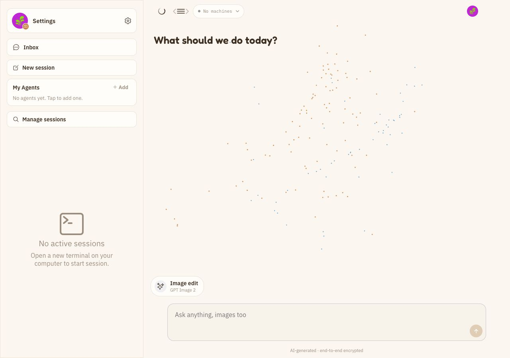
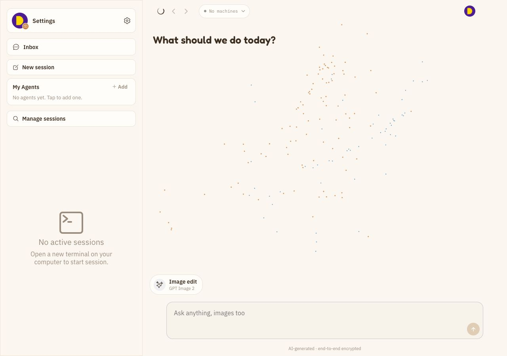
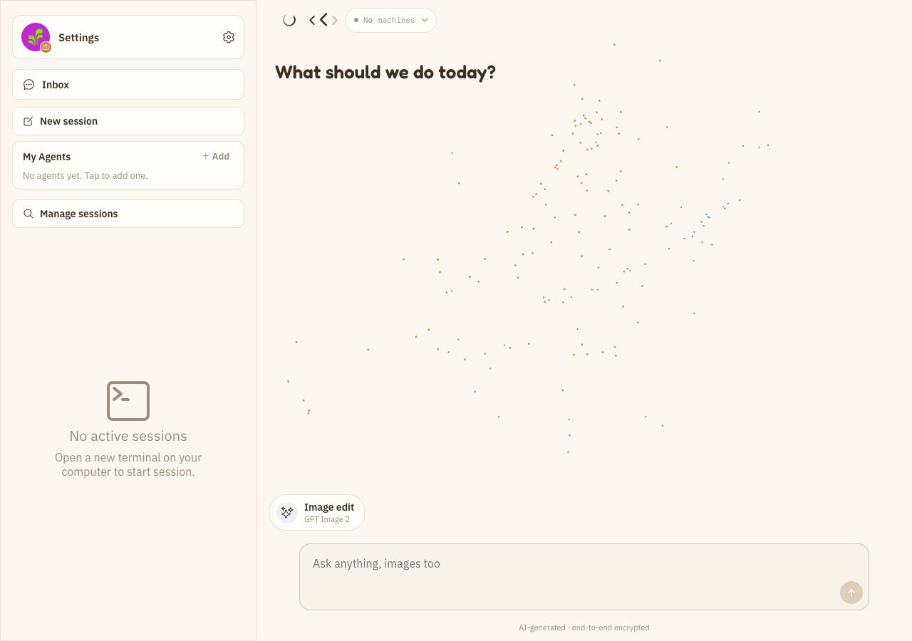
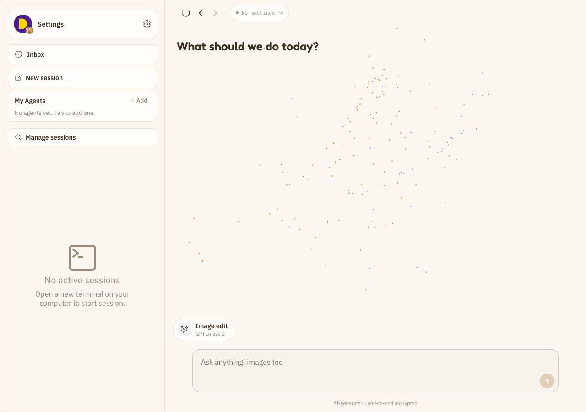

# Batch 01：桌面首页无效 Drawer Menu

> 修复 permanent sidebar 已经可见时仍显示手机 drawer menu，且点击没有任何反馈的问题。

## 一、批次信息

| 字段 | 内容 |
|---|---|
| 基线 commit | `d451341cef9eabfd35966029f2beac342e7f1516` |
| worktree | `happy--web-audit-round-01` |
| branch | `audit/web-round-01` |
| 页面 | `/` |
| 动态复现视口 | `1470 × 686`，浏览器缩放 100% |
| 匿名截图视口 | `1280 × 900`，隔离认证 E2E 环境 |
| 安全等级 | Safe：按钮只派发 drawer action，不修改业务数据 |

## 二、使用的工具与方法

| 目的 | 工具或方法 |
|---|---|
| 发现入口 | 路由静态清单 + 控制台风险静态扫描 |
| 动态确认 | Browser Control 接管现有登录态页面 |
| 行为证据 | 点击前时间戳 → 单击 hamburger → 采集新增日志和 URL |
| 视觉证据 | 操作前、操作后、修复后全页面截图 |
| 隐私处理 | 真实登录态只做动态验证；提交到 Git 的截图全部由隔离认证环境生成 |
| 根因定位 | 对比 `ComposeHome` 与正常工作的 `ChatHeaderView` desktop guard |
| 回归保护 | 隔离认证 Web E2E，执行 RED → GREEN |

## 三、复现

1. 在桌面宽度打开 `http://localhost:8081/`。
2. 确认左侧 permanent sidebar 已经完整显示。
3. 点击内容区顶部的 hamburger。
4. URL 不变、布局不变、没有弹层或其他反馈，点击窗口内控制台也没有新增日志。

这不是控制台错误，而是“看起来可点击、实际无行为”的交互缺陷。手机需要该按钮打开会话抽屉；桌面已经永久显示相同内容，不应继续呈现该按钮。

## 四、截图

### 修复前



### 点击后


### 修复后



### `/new` 桌面头部关联问题





## 五、根因

- `ComposeHome` 的 `home` variant 无条件渲染 hamburger。
- PC 使用 `SidebarNavigator` 的 permanent drawer，打开动作没有可见效果。
- 同仓库 `ChatHeaderView` 已经通过 `useIsTablet()` 只在手机布局显示 drawer menu；首页没有复用这一平台边界。

## 六、RED 证据

在真实隔离认证环境中增加桌面 E2E：

```text
Expected: 0 个手机 drawer menu
Received: 1 个
原有测试: 4 passed
新增测试: 1 failed
```

测试失败原因与浏览器复现一致，不是夹具或环境错误。

## 七、最小修复

- `ComposeHome` 读取 `useIsTablet()`。
- 手机 `/new` 保留局部返回；桌面 `/new` 使用持久全局返回。
- `home` variant 仅在非 tablet 布局渲染 drawer menu。
- 不修改手机 drawer 的派发逻辑。

## 八、交叉审查发现的关联问题

补齐 `/new` 回归测试时，真实鼠标点击暴露出第二个桌面头部问题：

- `/new` 自己渲染一个返回按钮。
- `SidebarNavigator` 同时在同一位置渲染全局后退/前进控件。
- 两组按钮发生视觉重叠，全局控件的命中区域拦截了局部返回按钮。

失败证据不是强制点击或脚本派发，而是 Playwright 连续等待真实命中目标，最终报告
`desktop-navigation-controls intercepts pointer events`。最终修复不再叠放两套桌面返回：
桌面 `/new` 统一使用持久全局返回，手机继续使用局部返回。

第二次 RED 还发现全局 Web 返回错误依赖导航器内部的 `canGoBack()`；Drawer 中的 Web
路由已经产生浏览器历史，但导航器可能仍报告不可返回。Web 全局返回现在按已经记录的
浏览器路由历史启用，并调用 `window.history.back()`，因此能够返回真实调用页，而不是
硬编码跳到首页。手机局部返回仍优先 `router.back()`，确实没有历史时才
`router.replace('/')`。

Browser Control 的命中探针还确认全宽 `PersistentHeader` 在 Web 上没有可靠实现
`box-none`：外层 overlay 会吃掉点击。普通浏览器改为 CSS `pointer-events: none`，
子控件保留 `auto`；Tauri 继续保留原来的 drag region，不应用浏览器穿透策略。

为避免 800px 断点附近全局控件继续压住机器 chip，本批抽取了共享布局计算：

- 侧栏宽度、按钮尺寸、间距和 hit slop 使用同一组常量。
- 只在全局控件的真实命中区与 800px 居中头部发生重叠时增加 content inset。
- 800px、1280px 和 1470px 的计算结果分别为 114px、54px 和 0px，不再使用固定大间距。

## 九、GREEN 与浏览器回归

```text
隔离 Web E2E: 9 passed
完整 Vitest: 125 files / 1007 tests passed
TypeScript: passed
Web export: passed
桌面首页 drawer menu 数量: 1 → 0
回归 URL: http://localhost:8081/
```

浏览器刷新后的已知启动警告仍有：

- `expo-notifications` Web listener 警告。
- `props.pointerEvents` 弃用警告。

它们与本问题根因不同，不在本批混合修改。

## 十、交叉审查、PR 与合并

- 独立代码审查：三轮均无 Critical；Tauri drag region、固定偏移和返回语义 3 个 Important 已按共享布局、平台分支和浏览器真实历史修正。最终复审确认代码无阻塞项；旧版截图也已用最终实现重新采集。
- PR：等待创建。
- CI：等待执行。
- merge commit：等待合并。
