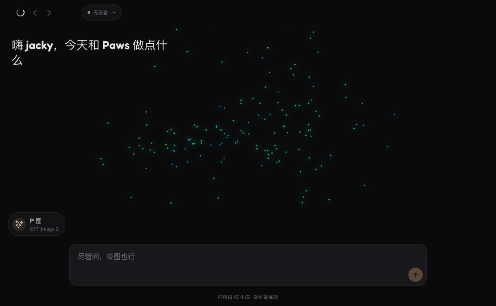
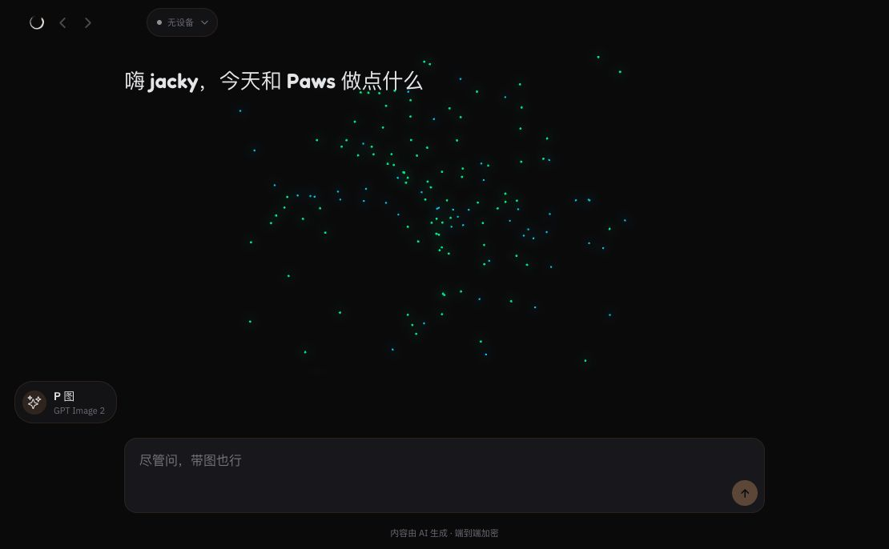

# Batch 02：桌面问候语与输入列对齐

> 修复 PC 首页和 `/new` 页面中，问候语沿用移动端左侧定位、与居中输入框内容列明显脱节的问题。

## 一、前置条件

- 基线 commit：`d7a8173ff1e46ffd74a3fa5b9e9c1ead9a6f1daf`
- worktree：`../happy--web-audit-round-02`
- branch：`audit/web-round-02`
- 浏览器：复用已有登录态，不读取 Cookie 或本地存储
- 复现页面：`http://localhost:8081/new`
- 实际视口：1470 × 686

## 二、使用的工具与方法

| 目的 | 工具或方法 | 本批使用方式 |
|---|---|---|
| 动态复现 | Browser Control | 打开真实登录页，测量可见问候语和输入内容列的 DOM 边界 |
| 视觉取证 | Browser Control 截图 | 从主内容区开始裁切，避开包含会话标题的个人侧栏 |
| 根因定位 | systematic debugging | 从错位元素向上测量父容器，比较问候区与 `MessageComposer` 的宽度约束 |
| 回归保护 | TDD / Web E2E | 先断言问候语和输入内容列左边界一致，记录失败差值，再修改布局 |
| 隔离开发 | sibling Git worktree | 从 Batch 01 合并后的 `main` 建分支，并在新 worktree 中执行 `pnpm install` |
| 完成检查 | verification before completion | 隔离认证 E2E、完整 Vitest、类型检查、Web 导出和真实页面回放 |

## 三、复现步骤

1. 在 1470px 宽桌面浏览器打开 `/new`。
2. 等待问候语、粒子背景和底部输入框渲染稳定。
3. 找到可见的问候语和输入内容列，读取二者 `getBoundingClientRect()`。
4. 裁切主内容区并保存基线截图。

检查结果：

```text
问候语左边界：386px
输入内容列左边界：515px
真实登录页错位：129px
```

隔离认证 E2E 使用 1280 × 900 视口，RED 结果为：

```text
Expected: <= 1
Received: 214
其他 9 条 Web E2E：passed
```



## 四、根因

`MessageComposer` 的内部内容列会以 `layout.maxWidth`（Web 为 800px）为上限居中。
问候区域只有固定的 26px 水平内边距，问候文字本身虽然限制为 360px，但其父级没有进入
相同的桌面内容列，因此窗口越宽，两者的左边界偏差越大。同时，360px 是移动端行宽，
在桌面仍原样使用会让本次真实中文标题的最后一个“么”孤立到第二行。

因此 WEB-008 包含两个相关根因：桌面父内容列缺失，以及桌面继续沿用移动端文字行宽。

## 五、修复

1. 为问候语增加宽度为 `100%`、最大宽度为 `layout.maxWidth` 的居中内容层。
2. 手机继续保留 360px 行宽；桌面和平板将问候文字最大宽度扩展到 520px。
3. 为问候语和输入内容列增加稳定的测试标识，避免自动化依赖翻译文案或 CSS class。
4. 在 Web E2E 中断言两者左边界差值不超过 1px。
5. 使用继承真实字体、字号、行高和最大宽度的隐藏排版探针，确认代表性中文标题
   `嗨 jacky，今天和 Paws 做点什么` 在桌面保持单行。

真实页面热更新后的 DOM 检查：

```text
问候语：x=515px，width=520px，height=34px
输入列：x=515px，width=800px
左边界差值：0px
桌面最大行宽：520px
代表性中文标题：单行
```



## 六、控制台观察

本批修复后的采集窗口没有新增布局相关错误。页面启动仍会出现已经登记、待独立批次处理的警告：

- `expo-notifications` 在 Web 上监听 push token 变化不受支持。
- `props.pointerEvents` 已弃用。
- `"shadow*"` 样式属性已弃用。

E2E 启停隔离 Metro 时出现的 `Disconnected from Metro (1006)` 属于测试服务切换日志，
不计为产品交互异常。

## 七、验证、审查与合并

- RED：隔离 Web E2E 新增用例失败，错位 214px；其余 9 条通过。
- Browser Control 回归：通过，真实登录页差值由 129px 变为 0px。
- 隔离 Web E2E：10 passed。
- 完整 Vitest：125 files / 1007 tests passed。
- TypeScript：passed。
- Web export：passed。为避开旧 `/usr/local/bin/watchman` 的等待，使用 ARM Homebrew 的
  `node/pnpm` 并从 `PATH` 排除 `/usr/local` 后完成导出。
- 独立代码审查：第一轮无 Critical，发现 1 个 Important——原始孤字换行尚未修复且测试未覆盖；增加桌面 520px 行宽和代表性中文单行探针后，复审确认该项已关闭，无剩余 Critical/Important。
- PR：等待创建。
- CI：等待执行。
- merge commit：等待合并。
