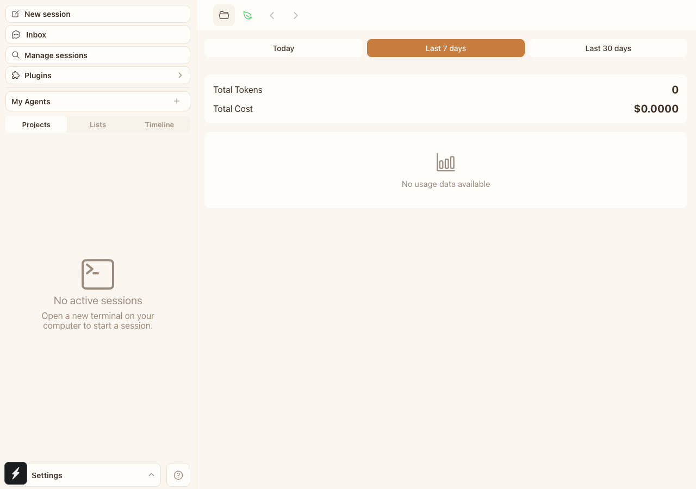
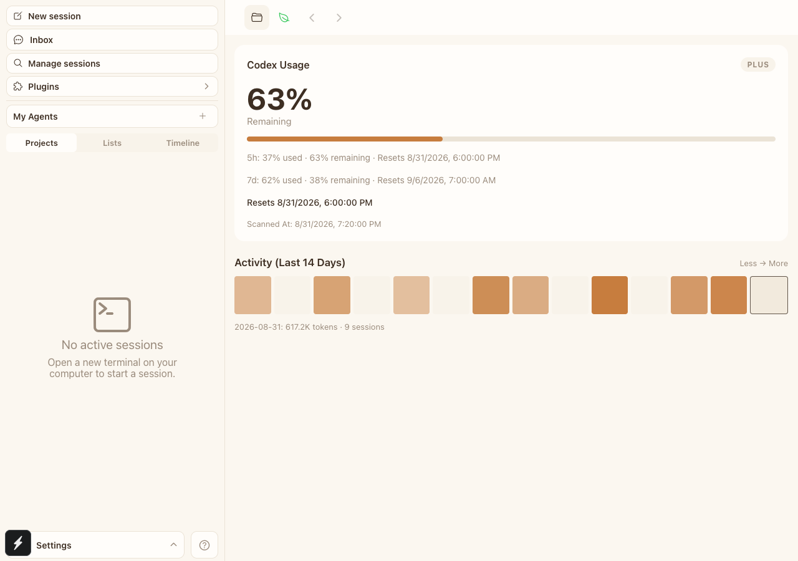
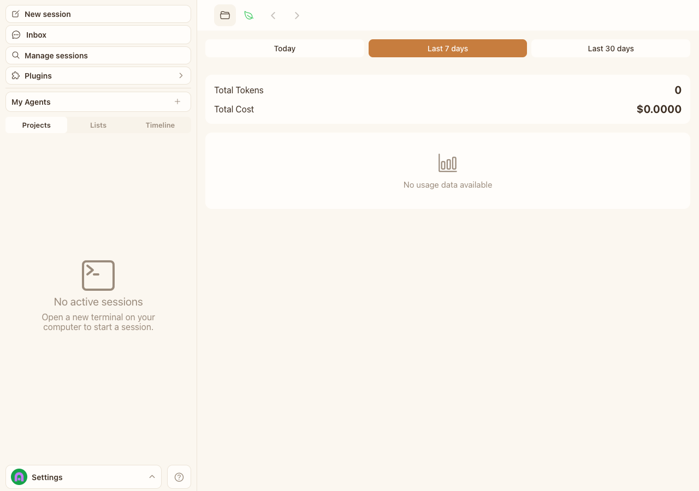
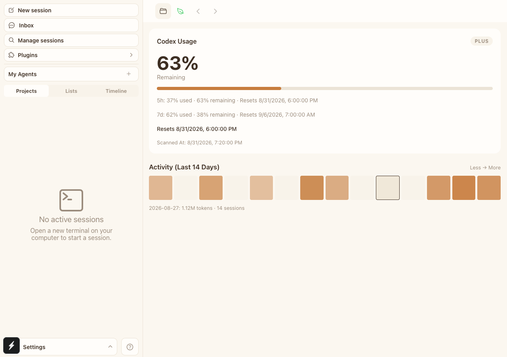

# Codex usage settings — visual evidence

- Visible UI cases: 2
- Viewport: `1280 × 900`, DPR 1
- Browser: Playwright Chrome
- Environment: isolated local `authenticated-empty` E2E environment; encrypted machine metadata and daemon state; no production connection or model request
- Baseline: `origin/main` at `67dc42a216e609e609e96ce3cf6affd61b07c4d3`

| Case | Problem | Before | After | Runtime assertions |
| --- | --- | --- | --- | --- |
| CU-01 — Codex quota and sync state | The Usage screen only showed empty API totals, so Codex plan, remaining quota, reset windows, and scan time were invisible. |  |  | The encrypted daemon snapshot renders `PLUS`, `63%` remaining, both 5-hour and 7-day windows, and the scan timestamp. |
| CU-02 — 14-day multi-machine activity | The Usage screen had no local Codex activity history or day-level drill-down. |  |  | Playwright clicks `2026-08-27` and verifies the selected-day detail `1.12M tokens · 14 sessions`. |

## Reproduction

Baseline (`origin/main` with the same evidence Spec):

```bash
HAPPY_CODEX_USAGE_EVIDENCE_PHASE=before \
HAPPY_CODEX_USAGE_EVIDENCE_DIR=<evidence-dir> \
pnpm test:e2e:web -- --grep '\[CODEX-USAGE-EVIDENCE\]'
```

Feature branch:

```bash
HAPPY_CODEX_USAGE_EVIDENCE_PHASE=after \
HAPPY_CODEX_USAGE_EVIDENCE_DIR=<evidence-dir> \
pnpm test:e2e:web -- --grep '\[CODEX-USAGE-EVIDENCE\]'
```
