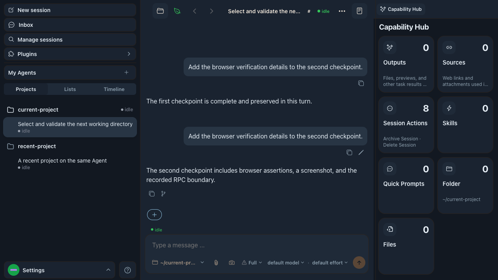
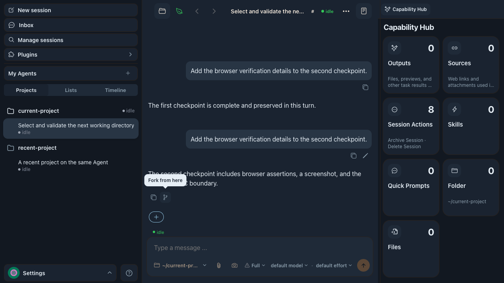
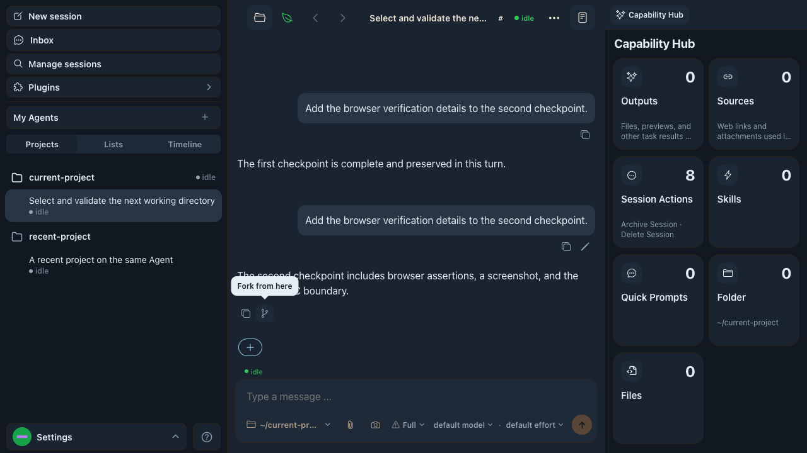
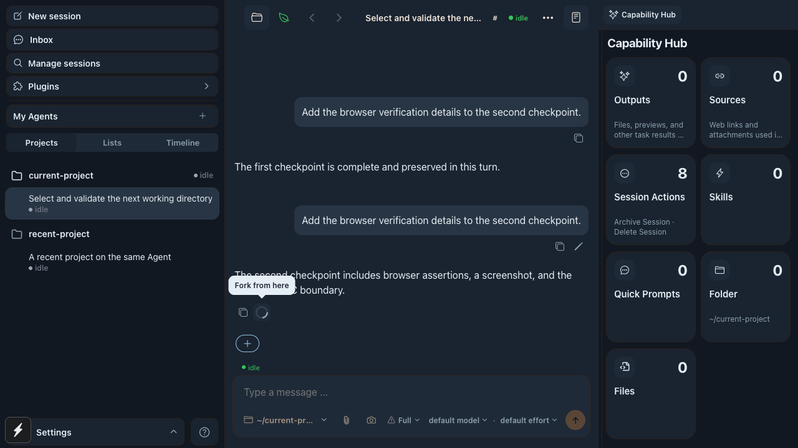
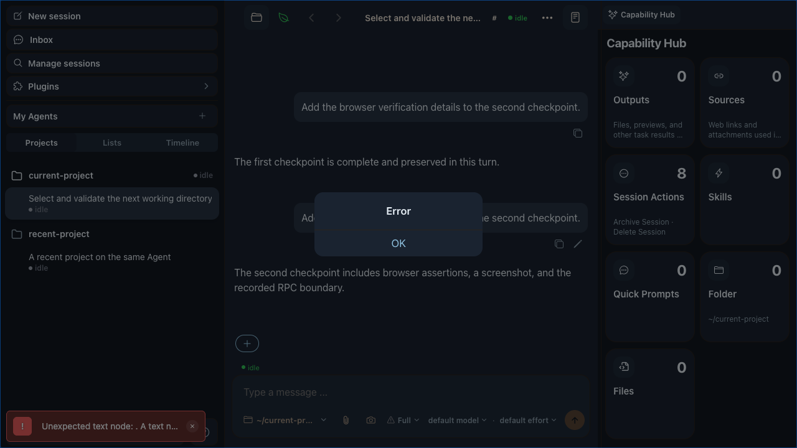
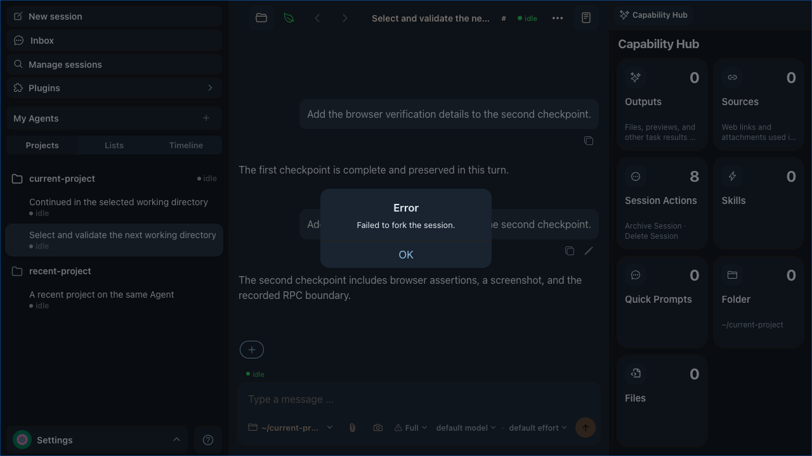

# Message fork feedback - visual evidence

Visible UI cases: 3

- Viewport: `1280 x 720`, DPR 1, dark gingham theme.
- Before: detached hover geometry, no pending feedback, and an empty error dialog were replayed from base commit `08c6035c0f962ca88294a570d595d90e08244ee6`.
- After: the same Playwright scenario and fixture were run against this branch.

## Case 1: stable hover path

The response action row now remains inside the hovered message boundary, so moving continuously from the response text to the Fork button does not cross a dead area.

| Before | After |
| --- | --- |
|  |  |

## Case 2: immediate loading feedback

The old UI retained the normal fork icon while the request was pending. The fixed UI immediately replaces it with a spinner and disables that message's Fork button.

| Before | After |
| --- | --- |
|  |  |

## Case 3: readable blank-error fallback

When the server returns an empty error message, the dialog now explains that the session could not be forked instead of showing only an `Error` title.

| Before | After |
| --- | --- |
|  |  |

Automated coverage: `pnpm test:e2e:web -- e2e/web-compose-home.spec.ts --grep MESSAGE-HOVER-ACTIONS --trace=off` passed against both the base commit and this branch in isolated local environments. The after run also verifies the complete pointer path, tooltip alignment, action hit targets, hover containment, pending accessibility state, RPC sequence, session spawn/navigation, and the blank-error fallback.
