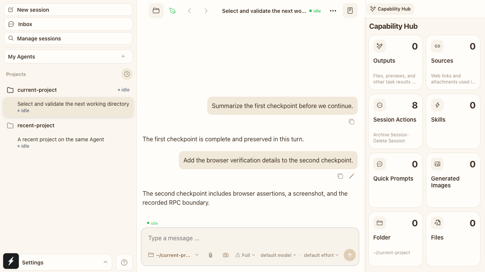

# Message-level response actions - visual evidence

Visible UI cases: 1

## Case 1: agent response hover actions

- Viewport: `1280 x 720`, DPR 1
- Before: hovering an agent response exposes no response-level actions.
- After: hovering the same response reveals Copy and Fork buttons without shifting the surrounding conversation.

| Before | After |
| --- | --- |
|  |  |

Automated coverage: `pnpm test:e2e:web -- --grep '\[MESSAGE-HOVER-ACTIONS\]'` passed against both clean `origin/main` and this branch in isolated local environments. The after Case also verifies clipboard output, selected rewind point, retained Codex turn, fork lineage, spawn parameters, and navigation to the new session.
