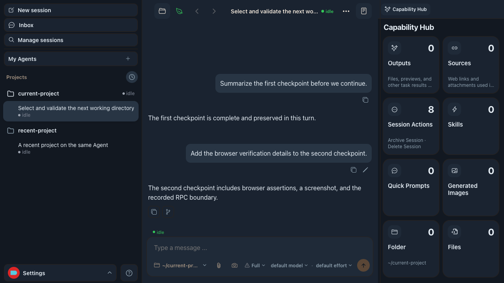

# Message-level response actions - visual evidence

Visible UI cases: 1

## Case 1: agent response hover actions

- Viewport: `1280 x 720`, DPR 1
- Before: hovering an agent response exposes no response-level actions.
- After: hovering the same response reveals fully visible Copy and Fork buttons above the composer. Copy writes the response text, and Fork immediately opens a new session from that turn without a rewind-point dialog.

| Before | After |
| --- | --- |
|  |  |

Gingham Dark final state:

Automated coverage: `pnpm test:e2e:web -- --grep '\[MESSAGE-HOVER-ACTIONS\]'` passed in normal and recording modes in isolated local environments. The Case verifies that all four corners and the center of both controls hit the intended button, the clipboard receives the exact response, no dialog opens, the selected Codex turn is retained, fork lineage and spawn parameters are correct, and navigation reaches the exact new session.
