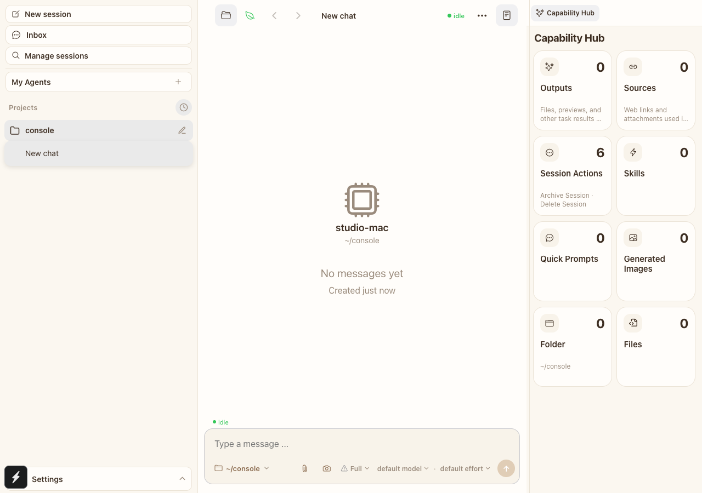

# Remove project more action — visual evidence

Visible UI cases: 1

## Case 1: project hover action cluster

- Viewport: `1280 × 900`, DPR 1
- Before: hovering a project row shows both the horizontal-more action and the new-session action.
- After: hovering the same project row shows only the new-session action; the project row remains compact and the existing right-click behavior is unchanged.

| Before | After |
| --- | --- |
|  |  |

Automated coverage: `pnpm test:e2e:web -- --grep '\[PROJECT-HOVER-ACTIONS\]'` passed against both the clean `origin/main` baseline and this branch in isolated local environments.
