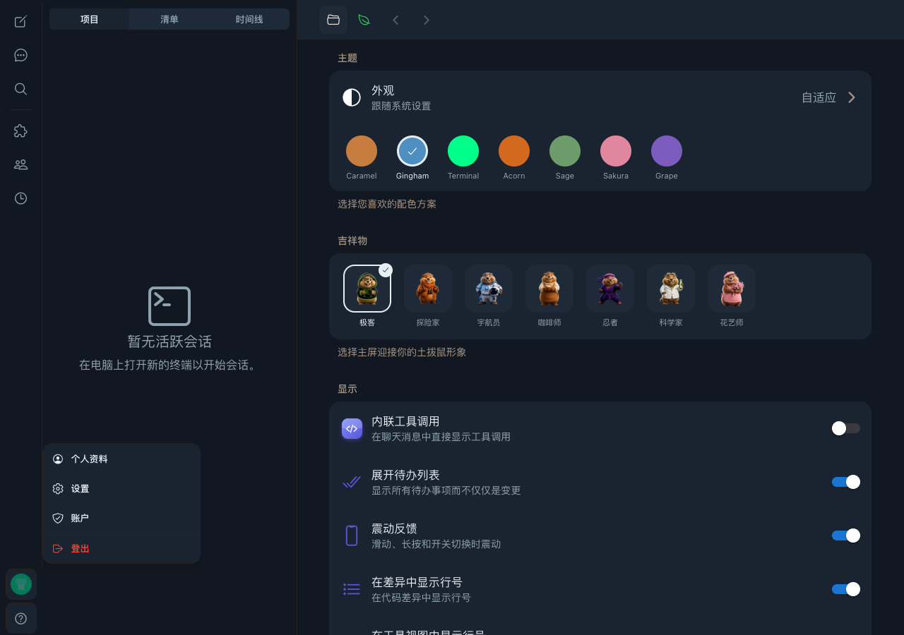
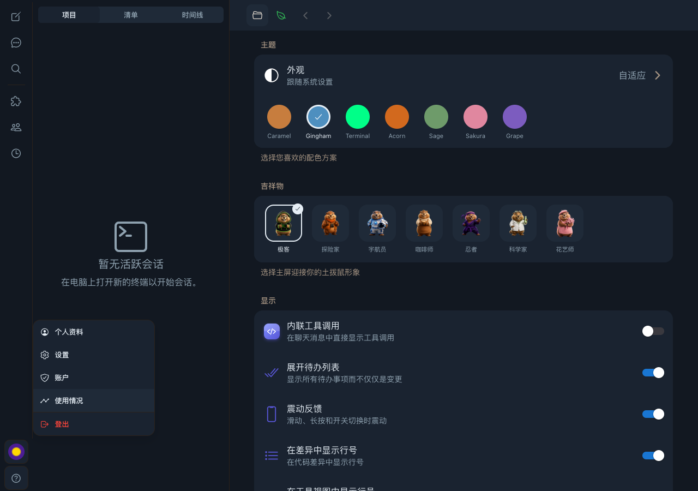

# Usage menu entry — visual evidence

- Visible UI cases: 1
- Viewport: `1280 × 900`, DPR 1
- Browser: Playwright Chrome
- Theme: non-default `ginghamDark`; body and Usage action surface colors asserted from the real theme pack
- Environment: isolated local `authenticated-empty` E2E environment; no production connection or model request
- Baseline: `origin/main` at `7e04215f5d614d031a8080c23bbfc74fa79e7be1`

| Case | Problem | Before | After | Runtime assertions |
| --- | --- | --- | --- | --- |
| USAGE-MENU-01 — direct usage access | Usage was only reachable through Settings, so checking reported Codex quota required an extra navigation level. |  |  | In `ginghamDark`, the body uses `#121821`, the Usage action uses `surface` (`#1A2330`) normally and `surfacePressed` (`#1F2A38`) while hovered or pressed; releasing navigates to `/settings/usage`, where the visible `Codex 用量` panel loads. |

## Reproduction

Baseline (`origin/main` with the same evidence Spec):

```bash
HAPPY_USAGE_MENU_EVIDENCE_PHASE=before \
HAPPY_USAGE_MENU_EVIDENCE_DIR=<absolute-evidence-dir> \
pnpm test:e2e:web -- sidebar-account-usage-evidence.spec.ts
```

Feature branch:

```bash
HAPPY_USAGE_MENU_EVIDENCE_PHASE=after \
HAPPY_USAGE_MENU_EVIDENCE_DIR=<absolute-evidence-dir> \
pnpm test:e2e:web -- sidebar-account-usage-evidence.spec.ts
```

The feature Case was rerun with `HAPPY_E2E_RECORD=1`. Its stable delivery artifact is
`usage-menu-acceptance.mp4` (H.264, yuv420p, 1280×720, 25 fps, 18.28 s); it completed an
`ffprobe`, full decode, and contact-sheet visual review.
